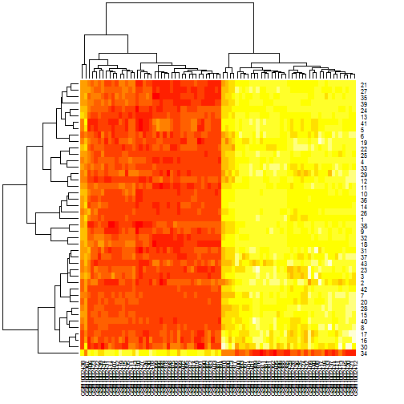

Biostat 578A HW2 Elisabeth Rosenthal
========================================================


```r
library(data.table)
library(knitr)
# access bioconductor
source("http://bioconductor.org/biocLite.R")
```

```
## Bioconductor version 2.13 (BiocInstaller 1.12.0), ?biocLite for help
```

```r
# install GEO meta database
biocLite("GEOmetadb")
```

```
## BioC_mirror: http://bioconductor.org
## Using Bioconductor version 2.13 (BiocInstaller 1.12.0), R version 3.0.2.
## Installing package(s) 'GEOmetadb'
```

```
## package 'GEOmetadb' successfully unpacked and MD5 sums checked
## 
## The downloaded binary packages are in
## 	C:\Users\Elisabeth\AppData\Local\Temp\RtmpwzEWJP\downloaded_packages
```

```
## Warning: installed directory not writable, cannot update packages 'boot',
##   'cluster', 'foreign', 'lattice', 'MASS', 'Matrix', 'mgcv', 'nlme',
##   'rpart', 'survival'
```

```
## Old packages: 'data.table', 'doRNG', 'IRanges', 'pkgmaker', 'rngtools',
##   'xtable'
```

```r
# get GE0 meta database package
library(GEOmetadb)
```

```
## Loading required package: GEOquery
## Loading required package: Biobase
## Loading required package: BiocGenerics
## Loading required package: parallel
## 
## Attaching package: 'BiocGenerics'
## 
## The following objects are masked from 'package:parallel':
## 
##     clusterApply, clusterApplyLB, clusterCall, clusterEvalQ,
##     clusterExport, clusterMap, parApply, parCapply, parLapply,
##     parLapplyLB, parRapply, parSapply, parSapplyLB
## 
## The following object is masked from 'package:stats':
## 
##     xtabs
## 
## The following objects are masked from 'package:base':
## 
##     anyDuplicated, append, as.data.frame, as.vector, cbind,
##     colnames, duplicated, eval, evalq, Filter, Find, get,
##     intersect, is.unsorted, lapply, Map, mapply, match, mget,
##     order, paste, pmax, pmax.int, pmin, pmin.int, Position, rank,
##     rbind, Reduce, rep.int, rownames, sapply, setdiff, sort,
##     table, tapply, union, unique, unlist
## 
## Welcome to Bioconductor
## 
##     Vignettes contain introductory material; view with
##     'browseVignettes()'. To cite Bioconductor, see
##     'citation("Biobase")', and for packages 'citation("pkgname")'.
## 
## Setting options('download.file.method.GEOquery'='auto')
## Loading required package: RSQLite
## Loading required package: DBI
```

```r

library(GEOquery)
# Download the mapping information and processed data
gds <- getGEO("GSE40812")
```

```
## Found 1 file(s)
## GSE40812_series_matrix.txt.gz
## File stored at: 
## C:\Users\ELISAB~1\AppData\Local\Temp\RtmpwzEWJP/GPL10558.soft
```

```r
# gds is a list with one element, which is an Expression set
gds[1]
```

```
## $GSE40812_series_matrix.txt.gz
## ExpressionSet (storageMode: lockedEnvironment)
## assayData: 47323 features, 80 samples 
##   element names: exprs 
## protocolData: none
## phenoData
##   sampleNames: GSM1002366 GSM1002367 ... GSM1002445 (80 total)
##   varLabels: title geo_accession ... data_row_count (33 total)
##   varMetadata: labelDescription
## featureData
##   featureNames: ILMN_1343291 ILMN_1343295 ... ILMN_3311190 (47323
##     total)
##   fvarLabels: ID Species ... GB_ACC (30 total)
##   fvarMetadata: Column Description labelDescription
## experimentData: use 'experimentData(object)'
## Annotation: GPL10558
```

```r
names(pData(gds[[1]]))
```

```
##  [1] "title"                   "geo_accession"          
##  [3] "status"                  "submission_date"        
##  [5] "last_update_date"        "type"                   
##  [7] "channel_count"           "source_name_ch1"        
##  [9] "organism_ch1"            "characteristics_ch1"    
## [11] "characteristics_ch1.1"   "characteristics_ch1.2"  
## [13] "molecule_ch1"            "extract_protocol_ch1"   
## [15] "label_ch1"               "label_protocol_ch1"     
## [17] "taxid_ch1"               "hyb_protocol"           
## [19] "scan_protocol"           "description"            
## [21] "data_processing"         "platform_id"            
## [23] "contact_name"            "contact_email"          
## [25] "contact_department"      "contact_institute"      
## [27] "contact_address"         "contact_city"           
## [29] "contact_state"           "contact_zip/postal_code"
## [31] "contact_country"         "supplementary_file"     
## [33] "data_row_count"
```

```r
gds.pdata <- pData(gds[[1]])
summary(gds.pdata[, "characteristics_ch1"])  # infection status
```

```
## infection status: Neg infection status: Pos 
##                    40                    40
```

```r
summary(gds.pdata[, "characteristics_ch1.1"])  # cell type
```

```
## cell type: Monocyte-derived Macrophage 
##                                     40 
##                        cell type: PBMC 
##                                     40
```

```r
summary(gds.pdata[, "characteristics_ch1.2"])  # treatment (mock or poly)
```

```
##      treatment: Mock treatment: Poly IC H treatment: Poly IC L 
##                   40                   20                   20
```

```r
summary(gds.pdata[, "description"])  # experimental conditions for each record
```

```
##                                     PBMCs from HCV-negative patient, Mock-treated 
##                                                                                10 
##                                PBMCs from HCV-negative patient, Poly IC L-treated 
##                                                                                10 
##                                     PBMCs from HCV-positive patient, Mock-treated 
##                                                                                10 
##                                PBMCs from HCV-positive patient, Poly IC L-treated 
##                                                                                10 
##      Primary Monocyte-derived Macrophages from HCV-negative patient, Mock-treated 
##                                                                                10 
## Primary Monocyte-derived Macrophages from HCV-negative patient, Poly IC H-treated 
##                                                                                10 
##      Primary Monocyte-derived Macrophages from HCV-positive patient, Mock-treated 
##                                                                                10 
## Primary Monocyte-derived Macrophages from HCV-positive patient, Poly IC H-treated 
##                                                                                10
```

```r
summary(gds.pdata[, "data_processing"])  # the values have already been Normalized using lumi package in bioconductor
```

```
## Microarray data from the validation cohort underwent quantile normalization using the lumi package in bioconductor [R version 2.13.2, Lumi version 2.4, Limma version 3.8.3]. 
##                                                                                                                                                                            80
```

```r


# there are no supplementary files create a new expression set with just the
# data that I need
gds_new <- gds
keepCols <- c("title", "characteristics_ch1", "characteristics_ch1.2")
pd <- gds.pdata[, keepCols]
colnames(pd) <- c("ptid", "vl.status", "poly")
split.ptid <- unlist(strsplit(as.character(pd$ptid), split = "_"))
pd$ptid <- split.ptid[grep("[0-9]{4}", split.ptid)]
pd$vl.status <- ifelse(grepl("Pos", pd$vl.status), 1, 0)
pd$poly <- ifelse(grepl("Poly", pd$poly), 1, 0)
pData(gds_new[[1]]) <- pd

# set up the design matrix and run the model
biocLite("limma")
```

```
## BioC_mirror: http://bioconductor.org
## Using Bioconductor version 2.13 (BiocInstaller 1.12.0), R version 3.0.2.
## Installing package(s) 'limma'
```

```
## package 'limma' successfully unpacked and MD5 sums checked
## 
## The downloaded binary packages are in
## 	C:\Users\Elisabeth\AppData\Local\Temp\RtmpwzEWJP\downloaded_packages
```

```
## Warning: installed directory not writable, cannot update packages 'boot',
##   'cluster', 'foreign', 'lattice', 'MASS', 'Matrix', 'mgcv', 'nlme',
##   'rpart', 'survival'
```

```
## Old packages: 'data.table', 'doRNG', 'IRanges', 'pkgmaker', 'rngtools',
##   'xtable'
```

```r
library(limma)
```

```
## 
## Attaching package: 'limma'
## 
## The following object is masked from 'package:BiocGenerics':
## 
##     plotMA
```

```r

mm.check <- model.matrix(~vl.status, gds_new[[1]])  # perform first test to get the genes that are differentially expressed with respect to vl.status. Including ptid makes it not estimable. 
fit.check <- lmFit(gds_new[[1]], mm.check)
ebay.check <- eBayes(fit.check)
topTable(ebay.check, coef = "vl.status")  # only one gene has an adjusted p-value less than 0.05. 
```

```
##                        ID      Species Source  Search_Key  Transcript
## ILMN_1791534 ILMN_1791534 Homo sapiens RefSeq XM_940876.1 ILMN_182935
## ILMN_2159694 ILMN_2159694 Homo sapiens RefSeq NM_021983.4  ILMN_18172
## ILMN_2323979 ILMN_2323979 Homo sapiens RefSeq NM_201263.2   ILMN_8250
## ILMN_1805148 ILMN_1805148 Homo sapiens RefSeq NM_152385.1  ILMN_17426
## ILMN_1764813 ILMN_1764813 Homo sapiens RefSeq NM_194318.2  ILMN_25412
## ILMN_1685978 ILMN_1685978 Homo sapiens RefSeq NM_178191.1  ILMN_17114
## ILMN_1811301 ILMN_1811301 Homo sapiens RefSeq NM_019892.3  ILMN_11866
## ILMN_3225304 ILMN_3225304 Homo sapiens RefSeq XR_039116.1 ILMN_343430
## ILMN_1765124 ILMN_1765124 Homo sapiens RefSeq XR_001033.1  ILMN_31294
## ILMN_3260618 ILMN_3260618 Homo sapiens RefSeq XR_039419.1 ILMN_341545
##                 ILMN_Gene Source_Reference_ID      RefSeq_ID Unigene_ID
## ILMN_1791534    LOC731682      XM_001129369.1 XM_001129369.1           
## ILMN_2159694     HLA-DRB4         NM_021983.4    NM_021983.4           
## ILMN_2323979        WARS2         NM_201263.2    NM_201263.2           
## ILMN_1805148      C2ORF63         NM_152385.1    NM_152385.1           
## ILMN_1764813      B3GALTL         NM_194318.3    NM_194318.3           
## ILMN_1685978       ATPIF1         NM_178191.1    NM_178191.1           
## ILMN_1811301       INPP5E         NM_019892.3    NM_019892.3           
## ILMN_3225304    LOC729484         XR_039116.1    XR_039116.1           
## ILMN_1765124    LOC641365         XR_001033.1    XR_001033.1           
## ILMN_3260618 LOC100128086         XR_039419.1    XR_039419.1           
##              Entrez_Gene_ID        GI      Accession       Symbol
## ILMN_1791534         731682 113430810 XM_001129369.1    LOC731682
## ILMN_2159694           3126  52630343    NM_021983.4     HLA-DRB4
## ILMN_2323979          10352 126273538    NM_201263.2        WARS2
## ILMN_1805148         130162  22748824    NM_152385.1      C2orf63
## ILMN_1764813         145173 154689816    NM_194318.3      B3GALTL
## ILMN_1685978          93974  30260191    NM_178191.1       ATPIF1
## ILMN_1811301          56623  47078290    NM_019892.3       INPP5E
## ILMN_3225304         729484 169204815    XR_039116.1    LOC729484
## ILMN_1765124         641365  88976627    XR_001033.1    LOC641365
## ILMN_3260618      100128086 169181052    XR_039419.1 LOC100128086
##              Protein_Product     Probe_Id Array_Address_Id Probe_Type
## ILMN_1791534  XP_001129369.1 ILMN_1791534            10333          A
## ILMN_2159694     NP_068818.4 ILMN_2159694          7330398          S
## ILMN_2323979     NP_957715.1 ILMN_2323979          2510687          A
## ILMN_1805148     NP_689598.1 ILMN_1805148          7610392          S
## ILMN_1764813     NP_919299.3 ILMN_1764813          4640673          S
## ILMN_1685978     NP_835498.1 ILMN_1685978          3780068          I
## ILMN_1811301     NP_063945.2 ILMN_1811301          3370255          S
## ILMN_3225304                 ILMN_3225304          3780692          A
## ILMN_1765124                 ILMN_1765124          4210402          A
## ILMN_3260618                 ILMN_3260618           620026          M
##              Probe_Start
## ILMN_1791534         942
## ILMN_2159694         849
## ILMN_2323979        2564
## ILMN_1805148        2115
## ILMN_1764813        3197
## ILMN_1685978        1501
## ILMN_1811301        3085
## ILMN_3225304         377
## ILMN_1765124         154
## ILMN_3260618         420
##                                                        SEQUENCE Chromosome
## ILMN_1791534 GGGCTGACTGAACCTATGGCTAAGAATTGTGACACTCTCATGTTTCAAGC           
## ILMN_2159694 CAGCCAACAGGACTCTTGAGCTGAAGTGCAGATGACCACATTCAAGGAAG          6
## ILMN_2323979 CCTTGTGTCAGAACACATGTTAATCCACAAAACGCCCCATCCCAGATTCC          1
## ILMN_1805148 TCTTAACCAGCTGAGGGAGCTTGTACAACACCTTATGTATGCTGGTTGGG          2
## ILMN_1764813 CCCTGGCTGCCTACACCAGTGGAAAAGAGTCTCCAGTTCTGCTCTGGCCT         13
## ILMN_1685978 CACTAGTTGAGGAGTAGAAGAGGATGACCAGCTAGACTCCCATGGAATTG          1
## ILMN_1811301 CCGTTTGCTTCTTTAACTCCAGCCGCGGAATGACATTAGTGGAACCGGGC          9
## ILMN_3225304 GACAAAGAGAAAGGTACCTGGGTTCGACTGAAGCCCCAGTCTGCTCCACC           
## ILMN_1765124 GGGGCCACCAGGTTTCAGGAAAGCAGCAATGACCCCTCAGTAATAGTTGG          4
## ILMN_3260618 CCCACTCTAAAGCTGCTGTGATGGCCACCCTTCTCTTTCGAGGATGGGAG          9
##              Probe_Chr_Orientation
## ILMN_1791534                      
## ILMN_2159694                     -
## ILMN_2323979                     -
## ILMN_1805148                     -
## ILMN_1764813                     +
## ILMN_1685978                     +
## ILMN_1811301                     -
## ILMN_3225304                      
## ILMN_1765124                     -
## ILMN_3260618                     +
##                                                  Probe_Coordinates
## ILMN_1791534                                                      
## ILMN_2159694 32579219-32579245:32579246-32579259:32579562-32579570
## ILMN_2323979                                   119574060-119574109
## ILMN_1805148                                     55256372-55256421
## ILMN_1764813                                     30803395-30803444
## ILMN_1685978                                     28436788-28436837
## ILMN_1811301                                   139323312-139323361
## ILMN_3225304                                                      
## ILMN_1765124                                   139271083-139271132
## ILMN_3260618                                   108919277-108919326
##              Cytoband
## ILMN_1791534         
## ILMN_2159694         
## ILMN_2323979    1p12b
## ILMN_1805148  2p16.1d
## ILMN_1764813 13q12.3d
## ILMN_1685978  1p35.3b
## ILMN_1811301  9q34.3d
## ILMN_3225304 12q14.3b
## ILMN_1765124         
## ILMN_3260618  9q31.2b
##                                                                                                                                                   Definition
## ILMN_1791534 "PREDICTED: Homo sapiens similar to HLA class II histocompatibility antigen, DQ(1) alpha chain precursor (DC-4 alpha chain) (LOC731682), mRNA."
## ILMN_2159694                                                          "Homo sapiens major histocompatibility complex, class II, DR beta 4 (HLA-DRB4), mRNA."
## ILMN_2323979  "Homo sapiens tryptophanyl tRNA synthetase 2, mitochondrial (WARS2), nuclear gene encoding mitochondrial protein, transcript variant 2, mRNA."
## ILMN_1805148                                                                              "Homo sapiens chromosome 2 open reading frame 63 (C2orf63), mRNA."
## ILMN_1764813                                                                             "Homo sapiens beta 1,3-galactosyltransferase-like (B3GALTL), mRNA."
## ILMN_1685978                    "Homo sapiens ATPase inhibitory factor 1 (ATPIF1), nuclear gene encoding mitochondrial protein, transcript variant 3, mRNA."
## ILMN_1811301                                                                     "Homo sapiens inositol polyphosphate-5-phosphatase, 72 kDa (INPP5E), mRNA."
## ILMN_3225304                                                                                        "PREDICTED: Homo sapiens misc_RNA (LOC729484), miscRNA."
## ILMN_1765124                                           "PREDICTED: Homo sapiens hypothetical protein LOC641365, transcript variant 5 (LOC641365), misc RNA."
## ILMN_3260618                                                                                     "PREDICTED: Homo sapiens misc_RNA (LOC100128086), miscRNA."
##                                                                                                                                                                                                                                                                                                                                                                                                                                                                                                                                                                                                                                                                                                                                                                                                                                                                                                                                                                                                                                                                                                                                                                                                                                                                                                                                                                                                                                                                                                                                                                                                                                                                                                                                                                                                                                                                                                                                                                                                       Ontology_Component
## ILMN_1791534                                                                                                                                                                                                                                                                                                                                                                                                                                                                                                                                                                                                                                                                                                                                                                                                                                                                                                                                                                                                                                                                                                                                                                                                                                                                                                                                                                                                                                                                                                                                                                                                                                                                                                                                                                                                                                                                                                                                                                                                            
## ILMN_2159694                                                                                                                                                                                                                                                                                                                                                                                                                                                                                                                                                                                                                                                                                                                                                                                                                                                                                                                                                                                                                                                                                                                                                                                                                                                                                                 "Double layer of lipid molecules that encloses all cells, and, in eukaryotes, many organelles; may be a single or double lipid bilayer; also includes associated proteins [goid 16020] [evidence IEA]; Penetrating at least one phospholipid bilayer of a membrane. May also refer to the state of being buried in the bilayer with no exposure outside the bilayer. When used to describe a protein, indicates that all or part of the peptide sequence is embedded in the membrane [goid 16021] [evidence IEA]; A transmembrane protein complex composed of an MHC class II alpha and MHC class II beta chain, and with or without a bound peptide or polysaccharide antigen [goid 42613] [evidence IEA]"
## ILMN_2323979                                                                                                                                                                                                                                                                                                                                                                                                                                                                                                                                                                                                                                                                                                                                                                                                                                                                                                                                                                  "All of the contents of a cell excluding the plasma membrane and nucleus, but including other subcellular structures [goid 5737] [evidence IEA]; A semiautonomous, self replicating organelle that occurs in varying numbers, shapes, and sizes in the cytoplasm of virtually all eukaryotic cells. It is notably the site of tissue respiration [goid 5739] [evidence IEA]; The gel-like material, with considerable fine structure, that lies in the matrix space, or lumen, of a mitochondrion. It contains the enzymes of the tricarboxylic acid cycle and, in some organisms, the enzymes concerned with fatty-acid oxidation [goid 5759] [evidence IEA]; All of the contents of a cell excluding the plasma membrane and nucleus, but including other subcellular structures [goid 5737] [evidence IEA]; A semiautonomous, self replicating organelle that occurs in varying numbers, shapes, and sizes in the cytoplasm of virtually all eukaryotic cells. It is notably the site of tissue respiration [goid 5739] [evidence IEA]"
## ILMN_1805148                                                                                                                                                                                                                                                                                                                                                                                                                                                                                                                                                                                                                                                                                                                                                                                                                                                                                                                                                                                                                                                                                                                                                                                                                                                                                                                                                                                                                                                                                                                                                                                                                                                                                                                                                                                                                                                                                                                                                                                                            
## ILMN_1764813                                                                                                                                                                                                                                                                                                                                                                                                                                                                                                                                                                                                                                                                                                                                                                                                                                                                                                                                                                      "The irregular network of unit membranes, visible only by electron microscopy, that occurs in the cytoplasm of many eukaryotic cells. The membranes form a complex meshwork of tubular channels, which are often expanded into slitlike cavities called cisternae. The ER takes two forms, rough (or granular), with ribosomes adhering to the outer surface, and smooth (with no ribosomes attached) [goid 5783] [evidence IEA]; The lipid bilayer surrounding the endoplasmic reticulum [goid 5789] [evidence IEA]; Double layer of lipid molecules that encloses all cells, and, in eukaryotes, many organelles; may be a single or double lipid bilayer; also includes associated proteins [goid 16020] [evidence IEA]; Penetrating at least one phospholipid bilayer of a membrane. May also refer to the state of being buried in the bilayer with no exposure outside the bilayer. When used to describe a protein, indicates that all or part of the peptide sequence is embedded in the membrane [goid 16021] [evidence IEA]"
## ILMN_1685978                                                                                                                                                                                                                                                                                                                                                                                                                                                                                                                                                                                                                                                                                                                                                                                                                                                                                                                                                                                                                                                                       "A semiautonomous, self replicating organelle that occurs in varying numbers, shapes, and sizes in the cytoplasm of virtually all eukaryotic cells. It is notably the site of tissue respiration [goid 5739] [pmid 12110673] [evidence IDA]; A semiautonomous, self replicating organelle that occurs in varying numbers, shapes, and sizes in the cytoplasm of virtually all eukaryotic cells. It is notably the site of tissue respiration [goid 5739] [evidence ISS]; A proton-transporting ATP synthase complex found in the mitochondrial membrane [goid 5753] [pmid 12110673] [evidence IDA]; The external part of the cell wall and/or plasma membrane [goid 9986] [pmid 15528193] [evidence IDA]; A semiautonomous, self replicating organelle that occurs in varying numbers, shapes, and sizes in the cytoplasm of virtually all eukaryotic cells. It is notably the site of tissue respiration [goid 5739] [evidence IEA]"
## ILMN_1811301 "The lipid bilayer surrounding any of the compartments of the Golgi apparatus [goid 139] [evidence IEA]; The part of a cell or its extracellular environment in which a gene product is located. A gene product may be located in one or more parts of a cell and its location may be as specific as a particular macromolecular complex, that is, a stable, persistent association of macromolecules that function together [goid 5575] [evidence ND ]; A compound membranous cytoplasmic organelle of eukaryotic cells, consisting of flattened, ribosome-free vesicles arranged in a more or less regular stack. The Golgi apparatus differs from the endoplasmic reticulum in often having slightly thicker membranes, appearing in sections as a characteristic shallow semicircle so that the convex side (cis or entry face) abuts the endoplasmic reticulum, secretory vesicles emerging from the concave side (trans or exit face). In vertebrate cells there is usually one such organelle, while in invertebrates and plants, where they are known usually as dictyosomes, there may be several scattered in the cytoplasm. The Golgi apparatus processes proteins produced on the ribosomes of the rough endoplasmic reticulum; such processing includes modification of the core oligosaccharides of glycoproteins, and the sorting and packaging of proteins for transport to a variety of cellular locations. Three different regions of the Golgi are now recognized both in terms of structure and function: cis, in the vicinity of the cis face, trans, in the vicinity of the trans face, and medial, lying between the cis and trans regions [goid 5794] [evidence IEA]; Double layer of lipid molecules that encloses all cells, and, in eukaryotes, many organelles; may be a single or double lipid bilayer; also includes associated proteins [goid 16020] [evidence IEA]; The lipid bilayer surrounding any of the compartments of the Golgi apparatus [goid 139] [evidence IEA]"
## ILMN_3225304                                                                                                                                                                                                                                                                                                                                                                                                                                                                                                                                                                                                                                                                                                                                                                                                                                                                                                                                                                                                                                                                                                                                                                                                                                                                                                                                                                                                                                                                                                                                                                                                                                                                                                                                                                                                                                                                                                                                                                                                            
## ILMN_1765124                                                                                                                                                                                                                                                                                                                                                                                                                                                                                                                                                                                                                                                                                                                                                                                                                                                                                                                                                                                                                                                                                                                                                                                                                                                                                                                                                                                                                                                                                                                                                                                                                                                                                                                                                                                                                                                                                                                                                                                                            
## ILMN_3260618                                                                                                                                                                                                                                                                                                                                                                                                                                                                                                                                                                                                                                                                                                                                                                                                                                                                                                                                                                                                                                                                                                                                                                                                                                                                                                                                                                                                                                                                                                                                                                                                                                                                                                                                                                                                                                                                                                                                                                                                            
##                                                                                                                                                                                                                                                                                                                                                                                                                                                                                                                                                                                                                                                                                                                                                                                                                                                                                                                                                                                                                                                                                                                                                                                                                                                                                                                                                                             Ontology_Process
## ILMN_1791534                                                                                                                                                                                                                                                                                                                                                                                                                                                                                                                                                                                                                                                                                                                                                                                                                                                                                                                                                                                                                                                                                                                                                                                                                                                                                                                                                                                
## ILMN_2159694                                                                                                                                                                                                                                                                                                                                                                                                                                                                                                                                                                                                                                                                                                                                                                                                                                                                                                                                                                                                                      The process by which an antigen-presenting cell expresses antigen (peptide or polysaccharide) on its cell surface in association with an MHC class II protein complex [goid 2504] [evidence IEA]; Any immune system process that functions in the calibrated response of an organism to a potential internal or invasive threat [goid 6955] [evidence IEA]
## ILMN_2323979                                                                                                                                                                                                                                                                                                                                                                                                                                                                                                                                                       "The process of coupling tryptophan to tryptophanyl-tRNA, catalyzed by tryptophanyl-tRNA synthetase. In tRNA aminoacylation, the amino acid is first activated by linkage to AMP and then transferred to either the 2'- or the 3'-hydroxyl group of the 3'-adenosine residue of the tRNA [goid 6436] [evidence IEA]; The differentiation of endothelial cells from progenitor cells during blood vessel development, and the de novo formation of blood vessels and tubes [goid 1570] [evidence IEA]; The process of coupling tryptophan to tryptophanyl-tRNA, catalyzed by tryptophanyl-tRNA synthetase. In tRNA aminoacylation, the amino acid is first activated by linkage to AMP and then transferred to either the 2'- or the 3'-hydroxyl group of the 3'-adenosine residue of the tRNA [goid 6436] [evidence IEA]"
## ILMN_1805148                                                                                                                                                                                                                                                                                                                                                                                                                                                                                                                                                                                                                                                                                                                                                                                                                                                                                                                                                                                                                                                                                                                                                                                                                                                                                                                                                                                
## ILMN_1764813                                                                                                                                                                                                                                                                                                                                                                                                                                                                                                                                                                                                                                                                                                                                                                                                                                                                                                                                   "The chemical reactions and pathways involving carbohydrates, any of a group of organic compounds based of the general formula Cx(H2O)y. Includes the formation of carbohydrate derivatives by the addition of a carbohydrate residue to another molecule [goid 5975] [evidence IEA]; The chemical reactions and pathways involving fucose, or 6-deoxygalactose, which has two enantiomers, D-fucose and L-fucose [goid 6004] [evidence IEA]"
## ILMN_1685978 "Blood vessel formation when new vessels emerge from the proliferation of pre-existing blood vessels [goid 1525] [pmid 15528193] [evidence TAS]; Any process that stops, prevents, or reduces the rate or extent of endothelial cell proliferation [goid 1937] [pmid 15528193] [evidence IDA]; The chemical reactions and pathways resulting in the formation of precursor metabolites, substances from which energy is derived, and any process involved in the liberation of energy from these substances [goid 6091] [pmid 10664857] [evidence TAS]; Any process that stops, prevents or reduces the frequency, rate or extent of the chemical reactions and pathways involving nucleotides [goid 45980] [evidence IEA]; The formation of a protein homotetramer, a macromolecular structure consisting of four noncovalently associated identical subunits [goid 51289] [evidence ISS]; Any process that stops or reduces the rate of hydrolase activity, the catalysis of the hydrolysis of various bonds [goid 51346] [pmid 15528193] [evidence IDA]; Any process that stops or reduces the rate of hydrolase activity, the catalysis of the hydrolysis of various bonds [goid 51346] [evidence ISS]; Any process that stops, prevents or reduces the frequency, rate or extent of the chemical reactions and pathways involving nucleotides [goid 45980] [evidence IEA]"
## ILMN_1811301                                                                                                                                                                                                                                                                                                                                                                                                                                                                                                                                                                                                                                                                                            "The chemical reactions and pathways involving lipids, compounds soluble in an organic solvent but not, or sparingly, in an aqueous solvent. Includes fatty acids; neutral fats, other fatty-acid esters, and soaps; long-chain (fatty) alcohols and waxes; sphingoids and other long-chain bases; glycolipids, phospholipids and sphingolipids; and carotenes, polyprenols, sterols, terpenes and other isoprenoids [goid 6629] [evidence IEA]; Any process specifically pertinent to the functioning of integrated living units: cells, tissues, organs, and organisms. A process is a collection of molecular events with a defined beginning and end [goid 8150] [evidence ND ]"
## ILMN_3225304                                                                                                                                                                                                                                                                                                                                                                                                                                                                                                                                                                                                                                                                                                                                                                                                                                                                                                                                                                                                                                                                                                                                                                                                                                                                                                                                                                                
## ILMN_1765124                                                                                                                                                                                                                                                                                                                                                                                                                                                                                                                                                                                                                                                                                                                                                                                                                                                                                                                                                                                                                                                                                                                                                                                                                                                                                                                                                                                
## ILMN_3260618                                                                                                                                                                                                                                                                                                                                                                                                                                                                                                                                                                                                                                                                                                                                                                                                                                                                                                                                                                                                                                                                                                                                                                                                                                                                                                                                                                                
##                                                                                                                                                                                                                                                                                                                                                                                                                                                                                                                                                                                                                                                                                                                                                                                                                                                                                                                                                                                                                                                                                                                                                                                                                                                                                                                                                                                                                                                                                                             Ontology_Function
## ILMN_1791534                                                                                                                                                                                                                                                                                                                                                                                                                                                                                                                                                                                                                                                                                                                                                                                                                                                                                                                                                                                                                                                                                                                                                                                                                                                                                                                                                                                                                                                                                                                 
## ILMN_2159694                                                                                                                                                                                                                                                                                                                                                                                                                                                                                                                                                                                                                                                                                                                                                                                                                                                                                                                                                                                                                                                                                                                                                                                                                                                                                                                                                                                                                                                                                                                 
## ILMN_2323979 "Interacting selectively with a nucleotide, any compound consisting of a nucleoside that is esterified with (ortho)phosphate or an oligophosphate at any hydroxyl group on the ribose or deoxyribose moiety [goid 166] [evidence IEA]; Catalysis of the reaction: ATP + L-tryptophan + tRNA(Trp) = AMP + diphosphate + L-tryptophanyl-tRNA(Trp) [goid 4830] [evidence IEA]; Interacting selectively with ATP, adenosine 5'-triphosphate, a universally important coenzyme and enzyme regulator [goid 5524] [evidence IEA]; Catalysis of the ligation of two substances with concomitant breaking of a diphosphate linkage, usually in a nucleoside triphosphate. Ligase is the systematic name for any enzyme of EC class 6 [goid 16874] [evidence IEA]; Interacting selectively with a nucleotide, any compound consisting of a nucleoside that is esterified with (ortho)phosphate or an oligophosphate at any hydroxyl group on the ribose or deoxyribose moiety [goid 166] [evidence IEA]; Catalysis of the reaction: ATP + L-tryptophan + tRNA(Trp) = AMP + diphosphate + L-tryptophanyl-tRNA(Trp) [goid 4830] [evidence IEA]; Interacting selectively with ATP, adenosine 5'-triphosphate, a universally important coenzyme and enzyme regulator [goid 5524] [evidence IEA]; Catalysis of the ligation of two substances with concomitant breaking of a diphosphate linkage, usually in a nucleoside triphosphate. Ligase is the systematic name for any enzyme of EC class 6 [goid 16874] [evidence IEA]"
## ILMN_1805148                                                                                                                                                                                                                                                                                                                                                                                                                                                                                                                                                                                                                                                                                                                                                                                                                                                                                                                                                                                                                                                                                                                                                                                                                                                                                                                                                                  "The selective, often stoichiometric, interaction of a molecule with one or more specific sites on another molecule [goid 5488] [evidence IEA]"
## ILMN_1764813                                                                                                                                                                                                                                                                                                                                                                                                                                                                                                                                                                                                                                                                                                                                                                                                                                                                                                                                                                                                                                                                                                                                                                                                                                                                                                                                                                                        Catalysis of the transfer of a glycosyl group from one compound (donor) to another (acceptor) [goid 16757] [evidence IEA]
## ILMN_1685978                                                      "Interacting selectively with calmodulin, a calcium-binding protein with many roles, both in the calcium-bound and calcium-free states [goid 5516] [evidence ISS]; Stops, prevents or reduces the activity of any enzyme that catalyzes the hydrolysis of ATP to ADP and orthophosphate [goid 42030] [pmid 15528193] [evidence IDA]; Stops, prevents or reduces the activity of any enzyme that catalyzes the hydrolysis of ATP to ADP and orthophosphate [goid 42030] [evidence ISS]; Stops, prevents or reduces the activity of any enzyme that catalyzes the hydrolysis of ATP to ADP and orthophosphate [goid 42030] [pmid 12110673] [evidence IDA]; Interacting selectively with an identical protein to form a homodimer [goid 42803] [evidence ISS]; Interacting selectively with angiostatin, a proteolytic product of plasminogen or plasmin containing at least one intact kringle domain, and which is an inhibitor of angiogenesis [goid 43532] [pmid 15528193] [evidence IDA]; Interacting selectively with an ATPase, any enzyme that catalyzes the hydrolysis of ATP [goid 51117] [evidence ISS]; Interacting selectively with an ATPase, any enzyme that catalyzes the hydrolysis of ATP [goid 51117] [pmid 15528193] [evidence IDA]; Interacting selectively with an ATPase, any enzyme that catalyzes the hydrolysis of ATP [goid 51117] [evidence ISS]; Stops, prevents or reduces the activity of an enzyme [goid 4857] [evidence IEA]"
## ILMN_1811301                                                                                                                                                                                                                                                                                                                                                           "Catalysis of the removal of a phosphate group from phosphorylated myo-inositol (1,2,3,5/4,6-cyclohexanehexol) or a phosphatidylinositol [goid 4437] [evidence IEA]; Catalysis of the reaction: 1-phosphatidyl-1D-myo-inositol 4,5-bisphosphate + H2O = 1-phosphatidyl-1D-myo-inositol 4-phosphate + phosphate [goid 4439] [evidence IEA]; Catalysis of the reactions: D-myo-inositol 1,4,5-trisphosphate + H2O = myo-inositol 1,4-bisphosphate + phosphate, and 1D-myo-inositol 1,3,4,5-tetrakisphosphate + H2O = 1D-myo-inositol 1,3,4-trisphosphate + phosphate [goid 4445] [pmid 10764818] [evidence TAS]; Catalysis of the hydrolysis of various bonds, e.g. C-O, C-N, C-C, phosphoric anhydride bonds, etc. Hydrolase is the systematic name for any enzyme of EC class 3 [goid 16787] [evidence IEA]; Catalysis of the removal of a phosphate group from phosphorylated myo-inositol (1,2,3,5/4,6-cyclohexanehexol) or a phosphatidylinositol [goid 4437] [evidence IEA]; Catalysis of the reaction: 1-phosphatidyl-1D-myo-inositol 4,5-bisphosphate + H2O = 1-phosphatidyl-1D-myo-inositol 4-phosphate + phosphate [goid 4439] [evidence IEA]"
## ILMN_3225304                                                                                                                                                                                                                                                                                                                                                                                                                                                                                                                                                                                                                                                                                                                                                                                                                                                                                                                                                                                                                                                                                                                                                                                                                                                                                                                                                                                                                                                                                                                 
## ILMN_1765124                                                                                                                                                                                                                                                                                                                                                                                                                                                                                                                                                                                                                                                                                                                                                                                                                                                                                                                                                                                                                                                                                                                                                                                                                                                                                                                                                                                                                                                                                                                 
## ILMN_3260618                                                                                                                                                                                                                                                                                                                                                                                                                                                                                                                                                                                                                                                                                                                                                                                                                                                                                                                                                                                                                                                                                                                                                                                                                                                                                                                                                                                                                                                                                                                 
##                                        Synonyms
## ILMN_1791534                                   
## ILMN_2159694 HLA DRB1; DRB4; HLA-DRB1; HLA-DR4B
## ILMN_2323979                              TrpRS
## ILMN_1805148                           FLJ31438
## ILMN_1764813  B3Glc-T; B3GTL; Gal-T; beta3Glc-T
## ILMN_1685978  ATPIP; MGC1167; IP; ATPI; MGC8898
## ILMN_1811301                 MGC117201; PPI5PIV
## ILMN_3225304                                   
## ILMN_1765124                                   
## ILMN_3260618                                   
##                               Obsolete_Probe_Id         GB_ACC    logFC
## ILMN_1791534                                    XM_001129369.1  1.29465
## ILMN_2159694 DRB4; HLA DRB1; HLA-DRB1; HLA-DR4B    NM_021983.4  1.33708
## ILMN_2323979                              TrpRS    NM_201263.2  0.18861
## ILMN_1805148                           FLJ31438    NM_152385.1 -0.16322
## ILMN_1764813                                       NM_194318.3 -0.12864
## ILMN_1685978  ATPIP; ATPI; MGC8898; MGC1167; IP    NM_178191.1 -0.10482
## ILMN_1811301                 MGC117201; PPI5PIV    NM_019892.3 -0.29039
## ILMN_3225304                                       XR_039116.1 -0.05863
## ILMN_1765124                                       XR_001033.1  0.05648
## ILMN_3260618                                       XR_039419.1 -0.36031
##              AveExpr      t   P.Value adj.P.Val      B
## ILMN_1791534   7.373  5.486 4.754e-07    0.0225 6.1172
## ILMN_2159694   7.654  4.706 1.053e-05    0.2208 3.2099
## ILMN_2323979   6.698  4.631 1.400e-05    0.2208 2.9435
## ILMN_1805148   6.838 -4.460 2.670e-05    0.3159 2.3408
## ILMN_1764813   7.072 -4.371 3.711e-05    0.3512 2.0344
## ILMN_1685978   6.896 -4.188 7.240e-05    0.5186 1.4133
## ILMN_1811301   7.405 -4.172 7.671e-05    0.5186 1.3596
## ILMN_3225304   6.526 -4.089 1.031e-04    0.6100 1.0854
## ILMN_1765124   6.651  3.971 1.563e-04    0.6959 0.7008
## ILMN_3260618   8.262 -3.943 1.722e-04    0.6959 0.6111
```

```r

mm.check <- model.matrix(~vl.status + poly, gds_new[[1]])  #not estimable if I include ptids.
fit.check <- lmFit(gds_new[[1]], mm.check)
ebay.check <- eBayes(fit.check)

topTable(ebay.check, coef = "poly")
```

```
##                        ID      Species Source   Search_Key  Transcript
## ILMN_3240420 ILMN_3240420 Homo sapiens RefSeq  NM_017414.3 ILMN_174490
## ILMN_2239754 ILMN_2239754 Homo sapiens RefSeq  NM_001549.2   ILMN_1944
## ILMN_1657871 ILMN_1657871 Homo sapiens RefSeq  NM_080657.3  ILMN_37168
## ILMN_1707695 ILMN_1707695 Homo sapiens RefSeq  NM_001548.2   ILMN_1751
## ILMN_1745242 ILMN_1745242 Homo sapiens RefSeq  NM_021105.1   ILMN_4441
## ILMN_1701789 ILMN_1701789 Homo sapiens RefSeq  NM_001549.2  ILMN_22925
## ILMN_1772964 ILMN_1772964 Homo sapiens RefSeq  NM_005623.2  ILMN_15634
## ILMN_2054019 ILMN_2054019 Homo sapiens RefSeq  NM_005101.1   ILMN_6174
## ILMN_1769734 ILMN_1769734 Homo sapiens RefSeq NM_016489.11  ILMN_12144
## ILMN_1690365 ILMN_1690365 Homo sapiens RefSeq  XM_937988.1 ILMN_167794
##              ILMN_Gene Source_Reference_ID      RefSeq_ID Unigene_ID
## ILMN_3240420     USP18         NM_017414.3    NM_017414.3           
## ILMN_2239754     IFIT3         NM_001549.2    NM_001549.2           
## ILMN_1657871     RSAD2         NM_080657.4    NM_080657.4           
## ILMN_1707695     IFIT1         NM_001548.3    NM_001548.3           
## ILMN_1745242    PLSCR1         NM_021105.1    NM_021105.1           
## ILMN_1701789     IFIT3      NM_001031683.1 NM_001031683.1           
## ILMN_1772964      CCL8         NM_005623.2    NM_005623.2           
## ILMN_2054019     ISG15         NM_005101.1    NM_005101.1           
## ILMN_1769734     NT5C3      NM_001002010.1 NM_001002010.1           
## ILMN_1690365     USP41         XM_036729.5    XM_036729.5           
##              Entrez_Gene_ID        GI      Accession Symbol
## ILMN_3240420          11274 156071510    NM_017414.3  USP18
## ILMN_2239754           3437  31542979    NM_001549.2  IFIT3
## ILMN_1657871          91543  90186265    NM_080657.4  RSAD2
## ILMN_1707695           3434 116534936    NM_001548.3  IFIT1
## ILMN_1745242           5359  10863876    NM_021105.1 PLSCR1
## ILMN_1701789           3437  72534657 NM_001031683.1  IFIT3
## ILMN_1772964           6355  22538815    NM_005623.2   CCL8
## ILMN_2054019           9636   4826773    NM_005101.1  ISG15
## ILMN_1769734          51251  70608081 NM_001002010.1  NT5C3
## ILMN_1690365         373856 113429367    XM_036729.5  USP41
##              Protein_Product     Probe_Id Array_Address_Id Probe_Type
## ILMN_3240420     NP_059110.2 ILMN_3240420          1740360          S
## ILMN_2239754     NP_001540.2 ILMN_2239754           520408          I
## ILMN_1657871     NP_542388.2 ILMN_1657871          3360343          S
## ILMN_1707695     NP_001539.3 ILMN_1707695          2000148          A
## ILMN_1745242     NP_066928.1 ILMN_1745242          3890609          S
## ILMN_1701789  NP_001026853.1 ILMN_1701789          1500280          A
## ILMN_1772964     NP_005614.2 ILMN_1772964          6620121          S
## ILMN_2054019     NP_005092.1 ILMN_2054019          2100196          S
## ILMN_1769734  NP_001002010.1 ILMN_1769734          7000398          A
## ILMN_1690365     XP_036729.4 ILMN_1690365          6110020          A
##              Probe_Start
## ILMN_3240420        1387
## ILMN_2239754          25
## ILMN_1657871        2250
## ILMN_1707695        1506
## ILMN_1745242         422
## ILMN_1701789        1625
## ILMN_1772964        1039
## ILMN_2054019         392
## ILMN_1769734         907
## ILMN_1690365         477
##                                                        SEQUENCE Chromosome
## ILMN_3240420 CCTACGGAAATCCTAACTACCACTGGCAGGAAACTGCATATCTTCTGGTT         22
## ILMN_2239754 ACAAATCAGCCTGGTCACCAGCTTTTCGGAACAGCAGAGACACAGAGGGC         10
## ILMN_1657871 CGCTGGAACCTTGGGCAAGGAAGAATGTGAGCAAGAGTAGAGAGAGTGCC          2
## ILMN_1707695 TGAATGAAGCCCTGGAGTACTATGAGCGGGCCCTGAGACTGGCTGCTGAC         10
## ILMN_1745242 CCTGGCCCAGCTGGCTTTCCTGTCCCAAATCAGCCAGTGTATAATCAGCC          3
## ILMN_1701789 GCCCCAACCTGGGATTGCTGAGCAGGGAAGCTTTGCATGTTGCTCTAAGG         10
## ILMN_1772964 GTCATTGTTCTCCCTCCTACCTGTCTGTAGTGTTGTGGGGTCCTCCCATG         17
## ILMN_2054019 ACCTGAAGCAGCAAGTGAGCGGGCTGGAGGGTGTGCAGGACGACCTGTTC          1
## ILMN_1769734 ACTCCCAAGGAGACTTAAGAATGGCAGATGGAGTGGCCAATGTTGAGCAC          7
## ILMN_1690365 TGCCATGGAGAGTAGCAGAAACAGCAGCATGCTCACCCTCCGACTTTCTT         22
##              Probe_Chr_Orientation                   Probe_Coordinates
## ILMN_3240420                     + 17036585-17036609:17039539-17039563
## ILMN_2239754                     +                   91077757-91077806
## ILMN_1657871                     +                     6954552-6954601
## ILMN_1707695                     +                   91153370-91153419
## ILMN_1745242                     -                 147729187-147729236
## ILMN_1701789                     +                   91089940-91089989
## ILMN_1772964                     +                   29672323-29672372
## ILMN_2054019                     +                       939540-939589
## ILMN_1769734                     -                   33057109-33057158
## ILMN_1690365                     -                   19053753-19053802
##                    Cytoband
## ILMN_3240420      22q11.21b
## ILMN_2239754      10q23.31b
## ILMN_1657871        2p25.2a
## ILMN_1707695      10q23.31b
## ILMN_1745242          3q24d
## ILMN_1701789      10q23.31b
## ILMN_1772964         17q12a
## ILMN_2054019       1p36.33b
## ILMN_1769734 7p14.3c-p14.3b
## ILMN_1690365      22q11.21d
##                                                                                                                   Definition
## ILMN_3240420                                                   "Homo sapiens ubiquitin specific peptidase 18 (USP18), mRNA."
## ILMN_2239754                       "Homo sapiens interferon-induced protein with tetratricopeptide repeats 3 (IFIT3), mRNA."
## ILMN_1657871                                 "Homo sapiens radical S-adenosyl methionine domain containing 2 (RSAD2), mRNA."
## ILMN_1707695 "Homo sapiens interferon-induced protein with tetratricopeptide repeats 1 (IFIT1), transcript variant 2, mRNA."
## ILMN_1745242                                                        "Homo sapiens phospholipid scramblase 1 (PLSCR1), mRNA."
## ILMN_1701789                       "Homo sapiens interferon-induced protein with tetratricopeptide repeats 3 (IFIT3), mRNA."
## ILMN_1772964                                                     "Homo sapiens chemokine (C-C motif) ligand 8 (CCL8), mRNA."
## ILMN_2054019                                                     "Homo sapiens ISG15 ubiquitin-like modifier (ISG15), mRNA."
## ILMN_1769734                              "Homo sapiens 5'-nucleotidase, cytosolic III (NT5C3), transcript variant 1, mRNA."
## ILMN_1690365                                        "PREDICTED: Homo sapiens ubiquitin specific peptidase 41 (USP41), mRNA."
##                                                                                                                                                                                                                                                                                                                                                                                                                                                                                                                                                                                                                                                                                                                                                                                                                                                                                                                                                                                                                                                                                                                                                                                                                                                                                                                                                                                                                                                                                                                                                                                                                                                                                  Ontology_Component
## ILMN_3240420                                                                                                                                                                                                                                                                                                                                                                                                                                                                                                                                                                                                                                                                                                                                                                                                                                                                                                                                                                                                                                                                                                                                                                                                                                                                                     "A membrane-bounded organelle of eukaryotic cells in which chromosomes are housed and replicated. In most cells, the nucleus contains all of the cell's chromosomes except the organellar chromosomes, and is the site of RNA synthesis and processing. In some species, or in specialized cell types, RNA metabolism or DNA replication may be absent [goid 5634] [pmid 10777664] [evidence TAS]"
## ILMN_2239754                                                                                                                                                                                                                                                                                                                                                                                                                                                                                                                                                                                                                                                                                                                                                                                                                                                                                                                                                                                                                                                                                                                                                                                                                                                                                                                                       "The part of a cell or its extracellular environment in which a gene product is located. A gene product may be located in one or more parts of a cell and its location may be as specific as a particular macromolecular complex, that is, a stable, persistent association of macromolecules that function together [goid 5575] [evidence ND ]"
## ILMN_1657871 "The irregular network of unit membranes, visible only by electron microscopy, that occurs in the cytoplasm of many eukaryotic cells. The membranes form a complex meshwork of tubular channels, which are often expanded into slitlike cavities called cisternae. The ER takes two forms, rough (or granular), with ribosomes adhering to the outer surface, and smooth (with no ribosomes attached) [goid 5783] [pmid 21625108] [evidence IDA]; A compound membranous cytoplasmic organelle of eukaryotic cells, consisting of flattened, ribosome-free vesicles arranged in a more or less regular stack. The Golgi apparatus differs from the endoplasmic reticulum in often having slightly thicker membranes, appearing in sections as a characteristic shallow semicircle so that the convex side (cis or entry face) abuts the endoplasmic reticulum, secretory vesicles emerging from the concave side (trans or exit face). In vertebrate cells there is usually one such organelle, while in invertebrates and plants, where they are known usually as dictyosomes, there may be several scattered in the cytoplasm. The Golgi apparatus processes proteins produced on the ribosomes of the rough endoplasmic reticulum; such processing includes modification of the core oligosaccharides of glycoproteins, and the sorting and packaging of proteins for transport to a variety of cellular locations. Three different regions of the Golgi are now recognized both in terms of structure and function: cis, in the vicinity of the cis face, trans, in the vicinity of the trans face, and medial, lying between the cis and trans regions [goid 5794] [evidence IEA]"
## ILMN_1707695                                                                                                                                                                                                                                                                                                                                                                                                                                                                                                                                                                                                                                                                                                                                                                                                                                                                                                                                                                                                                                                                                                                                                                                                                                                                                                                                                                                                                                                                                                                        "All of the contents of a cell excluding the plasma membrane and nucleus, but including other subcellular structures [goid 5737] [pmid 3753936] [evidence NAS]"
## ILMN_1745242                                                                                                                                                                                                                                                                                                                                                                                                                                                                                                                                                                                                                                                                                                                                                                                                                                                                                                                                                                                                                                                                                                                                                                            "The membrane surrounding a cell that separates the cell from its external environment. It consists of a phospholipid bilayer and associated proteins [goid 5886] [pmid 9218461] [evidence TAS]; Penetrating at least one phospholipid bilayer of a membrane. May also refer to the state of being buried in the bilayer with no exposure outside the bilayer. When used to describe a protein, indicates that all or part of the peptide sequence is embedded in the membrane [goid 16021] [evidence IEA]"
## ILMN_1701789                                                                                                                                                                                                                                                                                                                                                                                                                                                                                                                                                                                                                                                                                                                                                                                                                                                                                                                                                                                                                                                                                                                                                                                                                                                                                                                                       "The part of a cell or its extracellular environment in which a gene product is located. A gene product may be located in one or more parts of a cell and its location may be as specific as a particular macromolecular complex, that is, a stable, persistent association of macromolecules that function together [goid 5575] [evidence ND ]"
## ILMN_1772964                                                                                                                                                                                                                                                                                                                                                                                                                                                                                                                                                                                                                                                                                                                                                                                                                                                                                                                                                                                                           "The space external to the outermost structure of a cell. For cells without external protective or external encapsulating structures this refers to space outside of the plasma membrane. This term covers the host cell environment outside an intracellular parasite [goid 5576] [evidence IEA]; That part of a multicellular organism outside the cells proper, usually taken to be outside the plasma membranes, and occupied by fluid [goid 5615] [evidence IEA]; Double layer of lipid molecules that encloses all cells, and, in eukaryotes, many organelles; may be a single or double lipid bilayer; also includes associated proteins [goid 16020] [evidence IEA]"
## ILMN_2054019                                                                                                                                                                                                                                                                                                                                                                                                                                                                                                                                                                                                                                                                                                                                                                                                                                                                                                                                                                                                                                                                 "The space external to the outermost structure of a cell. For cells without external protective or external encapsulating structures this refers to space outside of the plasma membrane. This term covers the host cell environment outside an intracellular parasite [goid 5576] [evidence IEA]; That part of a multicellular organism outside the cells proper, usually taken to be outside the plasma membranes, and occupied by fluid [goid 5615] [evidence NAS]; All of the contents of a cell excluding the plasma membrane and nucleus, but including other subcellular structures [goid 5737] [evidence NAS]"
## ILMN_1769734                                                                                                                                                                                                                                                                                                                                                                                                                                                                                                                                                                                                                                                                                                                                                                                                                                                                                                                                                                                                                                                                        "All of the contents of a cell excluding the plasma membrane and nucleus, but including other subcellular structures [goid 5737] [pmid 8557639] [evidence IDA]; The irregular network of unit membranes, visible only by electron microscopy, that occurs in the cytoplasm of many eukaryotic cells. The membranes form a complex meshwork of tubular channels, which are often expanded into slitlike cavities called cisternae. The ER takes two forms, rough (or granular), with ribosomes adhering to the outer surface, and smooth (with no ribosomes attached) [goid 5783] [pmid 8557639] [evidence IDA]"
## ILMN_1690365                                                                                                                                                                                                                                                                                                                                                                                                                                                                                                                                                                                                                                                                                                                                                                                                                                                                                                                                                                                                                                                                                                                                                                                                                                                                                                                                                                                                                                                                                                                                                                                                                                                                                       
##                                                                                                                                                                                                                                                                                                                                                                                                                                                                                                                                                                                                                                                                                                                                                                                                                                                                                                                                                                                                                                                                                                                                                                                                                                                                                                                                                                                                                                                                                                                                                                                                                                                                                                                                                                                                                                                                                                               Ontology_Process
## ILMN_3240420                                                                                                                                                                                                                                                                                                                                                                                                                                                                                                                                                                                                                                                                                                                                                                                                                                                                                                                                                                                                                                                                                                                                                                                                                                                                                                                                                                                                                                                                                                                                                                                                                                                "The chemical reactions and pathways resulting in the breakdown of a protein or peptide by hydrolysis of its peptide bonds, initiated by the covalent attachment of a ubiquitin moiety, or multiple ubiquitin moieties, to the protein [goid 6511] [evidence IEA]"
## ILMN_2239754                                                                                                                                                                                                                                                                                                                                                                                                                                                                                                                                                                                                                                                                                                                                                                                                                                                                                                                                                                                                                                                                                                                                                                                                                                                                                                                                                                                                                                                                                                                                                                                                                                                                              "Any process specifically pertinent to the functioning of integrated living units: cells, tissues, organs, and organisms. A process is a collection of molecular events with a defined beginning and end [goid 8150] [evidence ND ]"
## ILMN_1657871                                                                                                                                                                                                                                                                                                                                                                                                                                                                                                                                                                                                                                                                                                                                                                                                                                                                                                                                                                                                                                                                                                                                                                                                                                                                                                                                                                                                                                                                  Reactions triggered in response to the presence of a virus that act to protect the cell or organism [goid 51607] [pmid 16982913] [evidence IDA]; Reactions triggered in response to the presence of a virus that act to protect the cell or organism [goid 51607] [pmid 16108059] [evidence IDA]; Reactions triggered in response to the presence of a virus that act to protect the cell or organism [goid 51607] [pmid 9391139] [evidence IDA]
## ILMN_1707695                                                                                                                                                                                                                                                                                                                                                                                                                                                                                                                                                                                                                                                                                                                                                                                                                                                                                                                                                                                                                                                                                                                                                                                                                                                                                                                                                                                                                                                                                                                                                                                                                                                                              "Any process specifically pertinent to the functioning of integrated living units: cells, tissues, organs, and organisms. A process is a collection of molecular events with a defined beginning and end [goid 8150] [evidence ND ]"
## ILMN_1745242                                                                                                                                                                                                                                                                                                                                                                                                                                                                                                                                                                                                                                                                                                                                                                                                                                                                                                                          "A change in state or activity of a cell or an organism (in terms of movement, secretion, enzyme production, gene expression, etc.) as a result of a stimulus from a virus [goid 9615] [evidence IEA]; The process by which all major lipid classes are redistributed within the plasma membrane following cell activation or injury, resulting in surface exposure of phosphatidylserine (PS) and phosphatidylethanolamine (PE). Cell surface-exposed PS can serve as receptor sites for coagulation enzyme complexes, and contributes to cell clearance by the reticuloendothelial system [goid 17121] [pmid 9218461] [evidence TAS]; A series of progressive, overlapping events triggered by exposure of the platelets to subendothelial tissue. These events include shape change, adhesiveness, aggregation, and release reactions. When carried through to completion, these events lead to the formation of a stable hemostatic plug [goid 30168] [pmid 9218461] [evidence NAS]"
## ILMN_1701789                                                                                                                                                                                                                                                                                                                                                                                                                                                                                                                                                                                                                                                                                                                                                                                                                                                                                                                                                                                                                                                                                                                                                                                                                                                                                                                                                                                                                                                                                                                                                                                                                                                                              "Any process specifically pertinent to the functioning of integrated living units: cells, tissues, organs, and organisms. A process is a collection of molecular events with a defined beginning and end [goid 8150] [evidence ND ]"
## ILMN_1772964 "The directed movement of calcium (Ca) ions into, out of, within or between cells [goid 6816] [pmid 10734056] [evidence TAS]; A process of secretion by a cell that results in the release of intracellular molecules (e.g. hormones, matrix proteins) contained within a membrane-bounded vesicle by fusion of the vesicle with the plasma membrane of a cell. This is the process whereby most molecules are secreted from eukaryotic cells [goid 6887] [pmid 10734056] [evidence TAS]; The directed movement of a motile cell or organism, or the directed growth of a cell guided by a specific chemical concentration gradient. Movement may be towards a higher concentration (positive chemotaxis) or towards a lower concentration (negative chemotaxis) [goid 6935] [pmid 9468473] [evidence TAS]; The immediate defensive reaction (by vertebrate tissue) to infection or injury caused by chemical or physical agents. The process is characterized by local vasodilation, extravasation of plasma into intercellular spaces and accumulation of white blood cells and macrophages [goid 6954] [evidence IEA]; Any immune system process that functions in the calibrated response of an organism to a potential internal or invasive threat [goid 6955] [evidence IEA]; The cascade of processes by which a signal interacts with a receptor, causing a change in the level or activity of a second messenger or other downstream target, and ultimately effecting a change in the functioning of the cell [goid 7165] [pmid 9119400] [evidence TAS]; Any process that mediates the transfer of information from one cell to another [goid 7267] [pmid 10734056] [evidence TAS]; A change in state or activity of a cell or an organism (in terms of movement, secretion, enzyme production, gene expression, etc.) as a result of a stimulus from a virus [goid 9615] [pmid 9468473] [evidence TAS]"
## ILMN_2054019                                                                                                                                                                                                                                                                                                                                                                                                                                                                                                                                                                                                                                                                                                                                                                          "The covalent alteration of one or more amino acids occurring in proteins, peptides and nascent polypeptides (co-translational, post-translational modifications). Includes the modification of charged tRNAs that are destined to occur in a protein (pre-translation modification) [goid 6464] [evidence IEA]; The chemical reactions and pathways resulting in the breakdown of a protein or peptide by hydrolysis of its peptide bonds, initiated by the covalent attachment of a ubiquitin moiety, or multiple ubiquitin moieties, to the protein [goid 6511] [evidence IEA]; Any process that mediates the transfer of information from one cell to another [goid 7267] [evidence NAS]; A change in state or activity of a cell or an organism (in terms of movement, secretion, enzyme production, gene expression, etc.) as a result of a stimulus from a virus [goid 9615] [evidence IEA]; The covalent addition to a protein of ISG15, a ubiquitin-like protein [goid 32020] [pmid 16122702] [evidence IDA]; Any process by which an organism has an effect on an organism of a different species [goid 44419] [evidence IEA]"
## ILMN_1769734                                                                                                                                                                                                                                                                                                                                                                                                                                                                                                                                                                                                                                                                                                                                                                                                                                                                                                                                                                                                                                                                                                                                                                                                                                                                                            "The chemical reactions and pathways involving any pyrimidine nucleoside, one of a family of organic molecules consisting of a pyrimidine base covalently bonded to a sugar ribose (a ribonucleoside) or deoxyribose (a deoxyribonucleoside) [goid 6213] [pmid 10942414] [evidence NAS]; The chemical reactions and pathways involving a nucleotide, a nucleoside that is esterified with (ortho)phosphate or an oligophosphate at any hydroxyl group on the glycose moiety; may be mono-, di- or triphosphate; this definition includes cyclic nucleotides (nucleoside cyclic phosphates) [goid 9117] [evidence IEA]"
## ILMN_1690365                                                                                                                                                                                                                                                                                                                                                                                                                                                                                                                                                                                                                                                                                                                                                                                                                                                                                                                                                                                                                                                                                                                                                                                                                                                                                                                                                                                                                                                                                                                                                                                                                                                "The chemical reactions and pathways resulting in the breakdown of a protein or peptide by hydrolysis of its peptide bonds, initiated by the covalent attachment of a ubiquitin moiety, or multiple ubiquitin moieties, to the protein [goid 6511] [evidence IEA]"
##                                                                                                                                                                                                                                                                                                                                                                                                                                                                                                                                                                                                                                                                                                                                                                                                                                                                                                                                                                                                                                                                                  Ontology_Function
## ILMN_3240420                                                                                                                                                                                                                                                                                        "Catalysis of the reaction: ubiquitin C-terminal thiolester + H2O = ubiquitin + a thiol. Hydrolysis of esters, including those formed between thiols such as dithiothreitol or glutathione and the C-terminal glycine residue of the polypeptide ubiquitin, and AMP-ubiquitin [goid 4221] [evidence IEA]; Catalysis of the hydrolysis of a peptide bond. A peptide bond is a covalent bond formed when the carbon atom from the carboxyl group of one amino acid shares electrons with the nitrogen atom from the amino group of a second amino acid [goid 8233] [evidence IEA]; Catalysis of the hydrolysis of peptide bonds in a polypeptide chain by a mechanism in which the sulfhydryl group of a cysteine residue at the active center acts as a nucleophile [goid 8234] [evidence IEA]"
## ILMN_2239754                                                                                                                                                                                                                                                                                                                                                                                                                                                                                                                                                                                                                                                                                                                                                                                                                                                                                                                                       "The selective, often stoichiometric, interaction of a molecule with one or more specific sites on another molecule [goid 5488] [evidence IEA]"
## ILMN_1657871                                                                                                                                                                                                                                                                                                                                           "Catalysis of a biochemical reaction at physiological temperatures. In biologically catalyzed reactions, the reactants are known as substrates, and the catalysts are naturally occurring macromolecular substances known as enzymes. Enzymes possess specific binding sites for substrates, and are usually composed wholly or largely of protein, but RNA that has catalytic activity (ribozyme) is often also regarded as enzymatic [goid 3824] [evidence IEA]; Interacting selectively with iron (Fe) ions [goid 5506] [evidence IEA]; Interacting selectively with any metal ion [goid 46872] [evidence IEA]; Interacting selectively with an iron-sulfur cluster, a combination of iron and sulfur atoms [goid 51536] [evidence IEA]"
## ILMN_1707695                                                                                                                                                                                                                                                                                                                                                                                                                                                                                                                                                                                                                                                                                                                                                                                                                                                                                                                                       "The selective, often stoichiometric, interaction of a molecule with one or more specific sites on another molecule [goid 5488] [evidence IEA]"
## ILMN_1745242                                                                                                                                                                                                                                                                                                                                                                                                                                                                                               "Interacting selectively with calcium ions (Ca2+) [goid 5509] [pmid 9218461] [evidence NAS]; Interacting selectively with any protein or protein complex (a complex of two or more proteins that may include other nonprotein molecules) [goid 5515] [pmid 16189514] [evidence IPI]; Interacting selectively with a SH3 domain (Src homology 3) of a protein, small protein modules containing approximately 50 amino acid residues found in a great variety of intracellular or membrane-associated proteins [goid 17124] [evidence IEA];  [goid 17128] [pmid 9218461] [evidence TAS]"
## ILMN_1701789                                                                                                                                                                                                                                                                                                                                                                                                                                                                                                                                                                                                                                                                                                                                                                                                                                                                                                                                       "The selective, often stoichiometric, interaction of a molecule with one or more specific sites on another molecule [goid 5488] [evidence IEA]"
## ILMN_1772964                                          "Mediates the transfer of a signal from the outside to the inside of a cell by means other than the introduction of the signal molecule itself into the cell [goid 4871] [pmid 9119400] [evidence TAS]; Mediates the transfer of a signal from the outside to the inside of a cell by means other than the introduction of the signal molecule itself into the cell [goid 4871] [pmid 10734056] [evidence TAS]; The function of a family of chemotactic pro-inflammatory activation-inducible cytokines acting primarily upon hemopoietic cells in immunoregulatory processes; all chemokines possess a number of conserved cysteine residues involved in intramolecular disulfide bond formation [goid 8009] [pmid 9468473] [evidence TAS]; Interacting selectively with heparin, any member of a group of glycosaminoglycans found mainly as an intracellular component of mast cells and which consist predominantly of alternating alpha1-4-linked D-galactose and N-acetyl-D-glucosamine-6-sulfate residues [goid 8201] [evidence IEA]"
## ILMN_2054019                                                                                                                                                                                                                                                                                                                                                                                                                                                                                                                                                                                                     "Interacting selectively with any protein or protein complex (a complex of two or more proteins that may include other nonprotein molecules) [goid 5515] [evidence NAS]; Acting as an indicator or marker to facilitate recognition by other molecules in the cell. Recognition of the tag, which can be covalently attached to the target molecule, may result in modification, sequestration, transport or degradation of the molecule in question [goid 31386] [evidence IEA]"
## ILMN_1769734 "Interacting selectively with a nucleotide, any compound consisting of a nucleoside that is esterified with (ortho)phosphate or an oligophosphate at any hydroxyl group on the ribose or deoxyribose moiety [goid 166] [evidence IEA]; Interacting selectively with magnesium (Mg) ions [goid 287] [pmid 11795870] [evidence NAS]; Catalysis of the reaction: a 5'-ribonucleotide + H2O = a ribonucleoside + phosphate [goid 8253] [pmid 10942414] [evidence IDA]; Catalysis of the reaction: a 5'-ribonucleotide + H2O = a ribonucleoside + phosphate [goid 8253] [pmid 12930399] [evidence NAS]; Catalysis of the transfer of a phosphate group from one compound to the 2' position of another [goid 8665] [pmid 9428647] [evidence NAS]; Catalysis of the transfer of a phosphate group from one compound to the 2' position of another [goid 8665] [pmid 10942414] [evidence TAS]; Catalysis of the hydrolysis of various bonds, e.g. C-O, C-N, C-C, phosphoric anhydride bonds, etc. Hydrolase is the systematic name for any enzyme of EC class 3 [goid 16787] [evidence IEA]"
## ILMN_1690365                                                                                                                                                                                                                                                                                        "Catalysis of the reaction: ubiquitin C-terminal thiolester + H2O = ubiquitin + a thiol. Hydrolysis of esters, including those formed between thiols such as dithiothreitol or glutathione and the C-terminal glycine residue of the polypeptide ubiquitin, and AMP-ubiquitin [goid 4221] [evidence IEA]; Catalysis of the hydrolysis of a peptide bond. A peptide bond is a covalent bond formed when the carbon atom from the carboxyl group of one amino acid shares electrons with the nitrogen atom from the amino group of a second amino acid [goid 8233] [evidence IEA]; Catalysis of the hydrolysis of peptide bonds in a polypeptide chain by a mechanism in which the sulfhydryl group of a cysteine residue at the active center acts as a nucleophile [goid 8234] [evidence IEA]"
##                                                                           Synonyms
## ILMN_3240420                                                          ISG43; UBP43
## ILMN_2239754                     IRG2; RIG-G; IFI60; ISG60; IFIT4; GARG-49; CIG-49
## ILMN_1657871                                      vig1; cig33; 2510004L01Rik; cig5
## ILMN_1707695                  RNM561; IFI-56; IFI56; GARG-16; IFNAI1; G10P1; ISG56
## ILMN_1745242                                                               MMTRA1B
## ILMN_1701789                     ISG60; IFIT4; IRG2; RIG-G; GARG-49; CIG-49; IFI60
## ILMN_1772964                                      HC14; MCP2; SCYA10; SCYA8; MCP-2
## ILMN_2054019                                                     G1P2; UCRP; IFI15
## ILMN_1769734 MGC27337; UMPH1; MGC87828; UMPH; MGC87109; PN-I; PSN1; cN-III; P5'N-1
## ILMN_1690365                                                                      
##                                                                  Obsolete_Probe_Id
## ILMN_3240420                                                          ISG43; UBP43
## ILMN_2239754                     IRG2; RIG-G; IFI60; ISG60; IFIT4; GARG-49; CIG-49
## ILMN_1657871                                             vig1; 2510004L01Rik; cig5
## ILMN_1707695                         RNM561; IFI-56; IFI56; GARG-16; IFNAI1; G10P1
## ILMN_1745242                                                               MMTRA1B
## ILMN_1701789                     IRG2; RIG-G; IFI60; ISG60; IFIT4; GARG-49; CIG-49
## ILMN_1772964                                      HC14; MCP2; SCYA10; SCYA8; MCP-2
## ILMN_2054019                                                     G1P2; UCRP; IFI15
## ILMN_1769734 MGC27337; PN-I; PSN1; UMPH1; MGC87828; UMPH; MGC87109; cN-III; P5'N-1
## ILMN_1690365                                                                      
##                      GB_ACC logFC AveExpr     t   P.Value adj.P.Val      B
## ILMN_3240420    NM_017414.3 3.168   8.241 47.59 1.206e-59 5.709e-55 122.91
## ILMN_2239754    NM_001549.2 5.194  10.328 46.20 1.134e-58 2.684e-54 120.90
## ILMN_1657871    NM_080657.4 5.542   9.820 42.10 1.252e-55 1.975e-51 114.53
## ILMN_1707695    NM_001548.3 5.460  10.637 40.96 9.967e-55 1.179e-50 112.63
## ILMN_1745242    NM_021105.1 2.550   8.426 37.82 3.813e-52 3.608e-48 107.12
## ILMN_1701789 NM_001031683.1 4.693  10.661 34.96 1.295e-49 1.021e-45 101.65
## ILMN_1772964    NM_005623.2 6.155  10.507 34.73 2.112e-49 1.428e-45 101.19
## ILMN_2054019    NM_005101.1 4.708  11.418 34.14 7.568e-49 4.477e-45  99.98
## ILMN_1769734 NM_001002010.1 3.287   9.543 33.30 4.673e-48 2.457e-44  98.26
## ILMN_1690365    XM_036729.5 1.833   7.529 32.87 1.216e-47 5.757e-44  97.35
```

```r
topTable(ebay.check, coef = "vl.status")
```

```
##                        ID      Species Source  Search_Key  Transcript
## ILMN_1791534 ILMN_1791534 Homo sapiens RefSeq XM_940876.1 ILMN_182935
## ILMN_1805148 ILMN_1805148 Homo sapiens RefSeq NM_152385.1  ILMN_17426
## ILMN_2159694 ILMN_2159694 Homo sapiens RefSeq NM_021983.4  ILMN_18172
## ILMN_2323979 ILMN_2323979 Homo sapiens RefSeq NM_201263.2   ILMN_8250
## ILMN_1685978 ILMN_1685978 Homo sapiens RefSeq NM_178191.1  ILMN_17114
## ILMN_1764813 ILMN_1764813 Homo sapiens RefSeq NM_194318.2  ILMN_25412
## ILMN_3225304 ILMN_3225304 Homo sapiens RefSeq XR_039116.1 ILMN_343430
## ILMN_1811301 ILMN_1811301 Homo sapiens RefSeq NM_019892.3  ILMN_11866
## ILMN_1659564 ILMN_1659564 Homo sapiens RefSeq NM_013336.3   ILMN_9397
## ILMN_1742332 ILMN_1742332 Homo sapiens RefSeq NM_138444.2  ILMN_18501
##              ILMN_Gene Source_Reference_ID      RefSeq_ID Unigene_ID
## ILMN_1791534 LOC731682      XM_001129369.1 XM_001129369.1           
## ILMN_1805148   C2ORF63         NM_152385.1    NM_152385.1           
## ILMN_2159694  HLA-DRB4         NM_021983.4    NM_021983.4           
## ILMN_2323979     WARS2         NM_201263.2    NM_201263.2           
## ILMN_1685978    ATPIF1         NM_178191.1    NM_178191.1           
## ILMN_1764813   B3GALTL         NM_194318.3    NM_194318.3           
## ILMN_3225304 LOC729484         XR_039116.1    XR_039116.1           
## ILMN_1811301    INPP5E         NM_019892.3    NM_019892.3           
## ILMN_1659564   SEC61A1         NM_013336.3    NM_013336.3           
## ILMN_1742332    KCTD12         NM_138444.3    NM_138444.3           
##              Entrez_Gene_ID        GI      Accession    Symbol
## ILMN_1791534         731682 113430810 XM_001129369.1 LOC731682
## ILMN_1805148         130162  22748824    NM_152385.1   C2orf63
## ILMN_2159694           3126  52630343    NM_021983.4  HLA-DRB4
## ILMN_2323979          10352 126273538    NM_201263.2     WARS2
## ILMN_1685978          93974  30260191    NM_178191.1    ATPIF1
## ILMN_1764813         145173 154689816    NM_194318.3   B3GALTL
## ILMN_3225304         729484 169204815    XR_039116.1 LOC729484
## ILMN_1811301          56623  47078290    NM_019892.3    INPP5E
## ILMN_1659564          29927  60218911    NM_013336.3   SEC61A1
## ILMN_1742332         115207 146149187    NM_138444.3    KCTD12
##              Protein_Product     Probe_Id Array_Address_Id Probe_Type
## ILMN_1791534  XP_001129369.1 ILMN_1791534            10333          A
## ILMN_1805148     NP_689598.1 ILMN_1805148          7610392          S
## ILMN_2159694     NP_068818.4 ILMN_2159694          7330398          S
## ILMN_2323979     NP_957715.1 ILMN_2323979          2510687          A
## ILMN_1685978     NP_835498.1 ILMN_1685978          3780068          I
## ILMN_1764813     NP_919299.3 ILMN_1764813          4640673          S
## ILMN_3225304                 ILMN_3225304          3780692          A
## ILMN_1811301     NP_063945.2 ILMN_1811301          3370255          S
## ILMN_1659564     NP_037468.1 ILMN_1659564          1030471          S
## ILMN_1742332     NP_612453.1 ILMN_1742332          5560500          S
##              Probe_Start
## ILMN_1791534         942
## ILMN_1805148        2115
## ILMN_2159694         849
## ILMN_2323979        2564
## ILMN_1685978        1501
## ILMN_1764813        3197
## ILMN_3225304         377
## ILMN_1811301        3085
## ILMN_1659564        3537
## ILMN_1742332        4221
##                                                        SEQUENCE Chromosome
## ILMN_1791534 GGGCTGACTGAACCTATGGCTAAGAATTGTGACACTCTCATGTTTCAAGC           
## ILMN_1805148 TCTTAACCAGCTGAGGGAGCTTGTACAACACCTTATGTATGCTGGTTGGG          2
## ILMN_2159694 CAGCCAACAGGACTCTTGAGCTGAAGTGCAGATGACCACATTCAAGGAAG          6
## ILMN_2323979 CCTTGTGTCAGAACACATGTTAATCCACAAAACGCCCCATCCCAGATTCC          1
## ILMN_1685978 CACTAGTTGAGGAGTAGAAGAGGATGACCAGCTAGACTCCCATGGAATTG          1
## ILMN_1764813 CCCTGGCTGCCTACACCAGTGGAAAAGAGTCTCCAGTTCTGCTCTGGCCT         13
## ILMN_3225304 GACAAAGAGAAAGGTACCTGGGTTCGACTGAAGCCCCAGTCTGCTCCACC           
## ILMN_1811301 CCGTTTGCTTCTTTAACTCCAGCCGCGGAATGACATTAGTGGAACCGGGC          9
## ILMN_1659564 GCTGACCCCAGCTTCCAGGGGACTGTCACTGTGGACGCCAAAATGGCATA          3
## ILMN_1742332 CTTGACATGAGCACCTTTAGATCCCTTCCCCTCCATGGGCTTTGGGCCAC         13
##              Probe_Chr_Orientation
## ILMN_1791534                      
## ILMN_1805148                     -
## ILMN_2159694                     -
## ILMN_2323979                     -
## ILMN_1685978                     +
## ILMN_1764813                     +
## ILMN_3225304                      
## ILMN_1811301                     -
## ILMN_1659564                     +
## ILMN_1742332                     -
##                                                  Probe_Coordinates
## ILMN_1791534                                                      
## ILMN_1805148                                     55256372-55256421
## ILMN_2159694 32579219-32579245:32579246-32579259:32579562-32579570
## ILMN_2323979                                   119574060-119574109
## ILMN_1685978                                     28436788-28436837
## ILMN_1764813                                     30803395-30803444
## ILMN_3225304                                                      
## ILMN_1811301                                   139323312-139323361
## ILMN_1659564                                   127790427-127790476
## ILMN_1742332                                     77456270-77456319
##              Cytoband
## ILMN_1791534         
## ILMN_1805148  2p16.1d
## ILMN_2159694         
## ILMN_2323979    1p12b
## ILMN_1685978  1p35.3b
## ILMN_1764813 13q12.3d
## ILMN_3225304 12q14.3b
## ILMN_1811301  9q34.3d
## ILMN_1659564  3q21.3b
## ILMN_1742332 13q22.3a
##                                                                                                                                                   Definition
## ILMN_1791534 "PREDICTED: Homo sapiens similar to HLA class II histocompatibility antigen, DQ(1) alpha chain precursor (DC-4 alpha chain) (LOC731682), mRNA."
## ILMN_1805148                                                                              "Homo sapiens chromosome 2 open reading frame 63 (C2orf63), mRNA."
## ILMN_2159694                                                          "Homo sapiens major histocompatibility complex, class II, DR beta 4 (HLA-DRB4), mRNA."
## ILMN_2323979  "Homo sapiens tryptophanyl tRNA synthetase 2, mitochondrial (WARS2), nuclear gene encoding mitochondrial protein, transcript variant 2, mRNA."
## ILMN_1685978                    "Homo sapiens ATPase inhibitory factor 1 (ATPIF1), nuclear gene encoding mitochondrial protein, transcript variant 3, mRNA."
## ILMN_1764813                                                                             "Homo sapiens beta 1,3-galactosyltransferase-like (B3GALTL), mRNA."
## ILMN_3225304                                                                                        "PREDICTED: Homo sapiens misc_RNA (LOC729484), miscRNA."
## ILMN_1811301                                                                     "Homo sapiens inositol polyphosphate-5-phosphatase, 72 kDa (INPP5E), mRNA."
## ILMN_1659564                                                                           "Homo sapiens Sec61 alpha 1 subunit (S. cerevisiae) (SEC61A1), mRNA."
## ILMN_1742332                                                           "Homo sapiens potassium channel tetramerisation domain containing 12 (KCTD12), mRNA."
##                                                                                                                                                                                                                                                                                                                                                                                                                                                                                                                                                                                                                                                                                                                                                                                                                                                                                                                                                                                                                                                                                                                                                                                                                                                                                                                                                                                                                                                                                                                                                                                                                                                                                                                                                                                                                                                                                                                                                                                                       Ontology_Component
## ILMN_1791534                                                                                                                                                                                                                                                                                                                                                                                                                                                                                                                                                                                                                                                                                                                                                                                                                                                                                                                                                                                                                                                                                                                                                                                                                                                                                                                                                                                                                                                                                                                                                                                                                                                                                                                                                                                                                                                                                                                                                                                                            
## ILMN_1805148                                                                                                                                                                                                                                                                                                                                                                                                                                                                                                                                                                                                                                                                                                                                                                                                                                                                                                                                                                                                                                                                                                                                                                                                                                                                                                                                                                                                                                                                                                                                                                                                                                                                                                                                                                                                                                                                                                                                                                                                            
## ILMN_2159694                                                                                                                                                                                                                                                                                                                                                                                                                                                                                                                                                                                                                                                                                                                                                                                                                                                                                                                                                                                                                                                                                                                                                                                                                                                                                                 "Double layer of lipid molecules that encloses all cells, and, in eukaryotes, many organelles; may be a single or double lipid bilayer; also includes associated proteins [goid 16020] [evidence IEA]; Penetrating at least one phospholipid bilayer of a membrane. May also refer to the state of being buried in the bilayer with no exposure outside the bilayer. When used to describe a protein, indicates that all or part of the peptide sequence is embedded in the membrane [goid 16021] [evidence IEA]; A transmembrane protein complex composed of an MHC class II alpha and MHC class II beta chain, and with or without a bound peptide or polysaccharide antigen [goid 42613] [evidence IEA]"
## ILMN_2323979                                                                                                                                                                                                                                                                                                                                                                                                                                                                                                                                                                                                                                                                                                                                                                                                                                                                                                                                                                  "All of the contents of a cell excluding the plasma membrane and nucleus, but including other subcellular structures [goid 5737] [evidence IEA]; A semiautonomous, self replicating organelle that occurs in varying numbers, shapes, and sizes in the cytoplasm of virtually all eukaryotic cells. It is notably the site of tissue respiration [goid 5739] [evidence IEA]; The gel-like material, with considerable fine structure, that lies in the matrix space, or lumen, of a mitochondrion. It contains the enzymes of the tricarboxylic acid cycle and, in some organisms, the enzymes concerned with fatty-acid oxidation [goid 5759] [evidence IEA]; All of the contents of a cell excluding the plasma membrane and nucleus, but including other subcellular structures [goid 5737] [evidence IEA]; A semiautonomous, self replicating organelle that occurs in varying numbers, shapes, and sizes in the cytoplasm of virtually all eukaryotic cells. It is notably the site of tissue respiration [goid 5739] [evidence IEA]"
## ILMN_1685978                                                                                                                                                                                                                                                                                                                                                                                                                                                                                                                                                                                                                                                                                                                                                                                                                                                                                                                                                                                                                                                                       "A semiautonomous, self replicating organelle that occurs in varying numbers, shapes, and sizes in the cytoplasm of virtually all eukaryotic cells. It is notably the site of tissue respiration [goid 5739] [pmid 12110673] [evidence IDA]; A semiautonomous, self replicating organelle that occurs in varying numbers, shapes, and sizes in the cytoplasm of virtually all eukaryotic cells. It is notably the site of tissue respiration [goid 5739] [evidence ISS]; A proton-transporting ATP synthase complex found in the mitochondrial membrane [goid 5753] [pmid 12110673] [evidence IDA]; The external part of the cell wall and/or plasma membrane [goid 9986] [pmid 15528193] [evidence IDA]; A semiautonomous, self replicating organelle that occurs in varying numbers, shapes, and sizes in the cytoplasm of virtually all eukaryotic cells. It is notably the site of tissue respiration [goid 5739] [evidence IEA]"
## ILMN_1764813                                                                                                                                                                                                                                                                                                                                                                                                                                                                                                                                                                                                                                                                                                                                                                                                                                                                                                                                                                      "The irregular network of unit membranes, visible only by electron microscopy, that occurs in the cytoplasm of many eukaryotic cells. The membranes form a complex meshwork of tubular channels, which are often expanded into slitlike cavities called cisternae. The ER takes two forms, rough (or granular), with ribosomes adhering to the outer surface, and smooth (with no ribosomes attached) [goid 5783] [evidence IEA]; The lipid bilayer surrounding the endoplasmic reticulum [goid 5789] [evidence IEA]; Double layer of lipid molecules that encloses all cells, and, in eukaryotes, many organelles; may be a single or double lipid bilayer; also includes associated proteins [goid 16020] [evidence IEA]; Penetrating at least one phospholipid bilayer of a membrane. May also refer to the state of being buried in the bilayer with no exposure outside the bilayer. When used to describe a protein, indicates that all or part of the peptide sequence is embedded in the membrane [goid 16021] [evidence IEA]"
## ILMN_3225304                                                                                                                                                                                                                                                                                                                                                                                                                                                                                                                                                                                                                                                                                                                                                                                                                                                                                                                                                                                                                                                                                                                                                                                                                                                                                                                                                                                                                                                                                                                                                                                                                                                                                                                                                                                                                                                                                                                                                                                                            
## ILMN_1811301 "The lipid bilayer surrounding any of the compartments of the Golgi apparatus [goid 139] [evidence IEA]; The part of a cell or its extracellular environment in which a gene product is located. A gene product may be located in one or more parts of a cell and its location may be as specific as a particular macromolecular complex, that is, a stable, persistent association of macromolecules that function together [goid 5575] [evidence ND ]; A compound membranous cytoplasmic organelle of eukaryotic cells, consisting of flattened, ribosome-free vesicles arranged in a more or less regular stack. The Golgi apparatus differs from the endoplasmic reticulum in often having slightly thicker membranes, appearing in sections as a characteristic shallow semicircle so that the convex side (cis or entry face) abuts the endoplasmic reticulum, secretory vesicles emerging from the concave side (trans or exit face). In vertebrate cells there is usually one such organelle, while in invertebrates and plants, where they are known usually as dictyosomes, there may be several scattered in the cytoplasm. The Golgi apparatus processes proteins produced on the ribosomes of the rough endoplasmic reticulum; such processing includes modification of the core oligosaccharides of glycoproteins, and the sorting and packaging of proteins for transport to a variety of cellular locations. Three different regions of the Golgi are now recognized both in terms of structure and function: cis, in the vicinity of the cis face, trans, in the vicinity of the trans face, and medial, lying between the cis and trans regions [goid 5794] [evidence IEA]; Double layer of lipid molecules that encloses all cells, and, in eukaryotes, many organelles; may be a single or double lipid bilayer; also includes associated proteins [goid 16020] [evidence IEA]; The lipid bilayer surrounding any of the compartments of the Golgi apparatus [goid 139] [evidence IEA]"
## ILMN_1659564                                                                                                                                                                                                                                                                                                                                                                                                                                                                                                                                                                                                                                                                                                                                                                                                                                                                                                                                                                      "The irregular network of unit membranes, visible only by electron microscopy, that occurs in the cytoplasm of many eukaryotic cells. The membranes form a complex meshwork of tubular channels, which are often expanded into slitlike cavities called cisternae. The ER takes two forms, rough (or granular), with ribosomes adhering to the outer surface, and smooth (with no ribosomes attached) [goid 5783] [evidence IEA]; The lipid bilayer surrounding the endoplasmic reticulum [goid 5789] [evidence IEA]; Double layer of lipid molecules that encloses all cells, and, in eukaryotes, many organelles; may be a single or double lipid bilayer; also includes associated proteins [goid 16020] [evidence IEA]; Penetrating at least one phospholipid bilayer of a membrane. May also refer to the state of being buried in the bilayer with no exposure outside the bilayer. When used to describe a protein, indicates that all or part of the peptide sequence is embedded in the membrane [goid 16021] [evidence IEA]"
## ILMN_1742332                                                                                                                                                                                                                                                                                                                                                                                                                                                                                                                                                                                                                                                                                                                                                                                                                                                                                                                                                                                                                                                                                                                                                                                                                                                                                                                                                                                                                                                                                                                                                                                                                 "A protein complex that forms a transmembrane channel through which potassium ions may cross a cell membrane in response to changes in membrane potential [goid 8076] [evidence IEA]; Double layer of lipid molecules that encloses all cells, and, in eukaryotes, many organelles; may be a single or double lipid bilayer; also includes associated proteins [goid 16020] [evidence IEA]"
##                                                                                                                                                                                                                                                                                                                                                                                                                                                                                                                                                                                                                                                                                                                                                                                                                                                                                                                                                                                                                                                                                                                                                                                                                                                                                                                                                                             Ontology_Process
## ILMN_1791534                                                                                                                                                                                                                                                                                                                                                                                                                                                                                                                                                                                                                                                                                                                                                                                                                                                                                                                                                                                                                                                                                                                                                                                                                                                                                                                                                                                
## ILMN_1805148                                                                                                                                                                                                                                                                                                                                                                                                                                                                                                                                                                                                                                                                                                                                                                                                                                                                                                                                                                                                                                                                                                                                                                                                                                                                                                                                                                                
## ILMN_2159694                                                                                                                                                                                                                                                                                                                                                                                                                                                                                                                                                                                                                                                                                                                                                                                                                                                                                                                                                                                                                      The process by which an antigen-presenting cell expresses antigen (peptide or polysaccharide) on its cell surface in association with an MHC class II protein complex [goid 2504] [evidence IEA]; Any immune system process that functions in the calibrated response of an organism to a potential internal or invasive threat [goid 6955] [evidence IEA]
## ILMN_2323979                                                                                                                                                                                                                                                                                                                                                                                                                                                                                                                                                       "The process of coupling tryptophan to tryptophanyl-tRNA, catalyzed by tryptophanyl-tRNA synthetase. In tRNA aminoacylation, the amino acid is first activated by linkage to AMP and then transferred to either the 2'- or the 3'-hydroxyl group of the 3'-adenosine residue of the tRNA [goid 6436] [evidence IEA]; The differentiation of endothelial cells from progenitor cells during blood vessel development, and the de novo formation of blood vessels and tubes [goid 1570] [evidence IEA]; The process of coupling tryptophan to tryptophanyl-tRNA, catalyzed by tryptophanyl-tRNA synthetase. In tRNA aminoacylation, the amino acid is first activated by linkage to AMP and then transferred to either the 2'- or the 3'-hydroxyl group of the 3'-adenosine residue of the tRNA [goid 6436] [evidence IEA]"
## ILMN_1685978 "Blood vessel formation when new vessels emerge from the proliferation of pre-existing blood vessels [goid 1525] [pmid 15528193] [evidence TAS]; Any process that stops, prevents, or reduces the rate or extent of endothelial cell proliferation [goid 1937] [pmid 15528193] [evidence IDA]; The chemical reactions and pathways resulting in the formation of precursor metabolites, substances from which energy is derived, and any process involved in the liberation of energy from these substances [goid 6091] [pmid 10664857] [evidence TAS]; Any process that stops, prevents or reduces the frequency, rate or extent of the chemical reactions and pathways involving nucleotides [goid 45980] [evidence IEA]; The formation of a protein homotetramer, a macromolecular structure consisting of four noncovalently associated identical subunits [goid 51289] [evidence ISS]; Any process that stops or reduces the rate of hydrolase activity, the catalysis of the hydrolysis of various bonds [goid 51346] [pmid 15528193] [evidence IDA]; Any process that stops or reduces the rate of hydrolase activity, the catalysis of the hydrolysis of various bonds [goid 51346] [evidence ISS]; Any process that stops, prevents or reduces the frequency, rate or extent of the chemical reactions and pathways involving nucleotides [goid 45980] [evidence IEA]"
## ILMN_1764813                                                                                                                                                                                                                                                                                                                                                                                                                                                                                                                                                                                                                                                                                                                                                                                                                                                                                                                                   "The chemical reactions and pathways involving carbohydrates, any of a group of organic compounds based of the general formula Cx(H2O)y. Includes the formation of carbohydrate derivatives by the addition of a carbohydrate residue to another molecule [goid 5975] [evidence IEA]; The chemical reactions and pathways involving fucose, or 6-deoxygalactose, which has two enantiomers, D-fucose and L-fucose [goid 6004] [evidence IEA]"
## ILMN_3225304                                                                                                                                                                                                                                                                                                                                                                                                                                                                                                                                                                                                                                                                                                                                                                                                                                                                                                                                                                                                                                                                                                                                                                                                                                                                                                                                                                                
## ILMN_1811301                                                                                                                                                                                                                                                                                                                                                                                                                                                                                                                                                                                                                                                                                            "The chemical reactions and pathways involving lipids, compounds soluble in an organic solvent but not, or sparingly, in an aqueous solvent. Includes fatty acids; neutral fats, other fatty-acid esters, and soaps; long-chain (fatty) alcohols and waxes; sphingoids and other long-chain bases; glycolipids, phospholipids and sphingolipids; and carotenes, polyprenols, sterols, terpenes and other isoprenoids [goid 6629] [evidence IEA]; Any process specifically pertinent to the functioning of integrated living units: cells, tissues, organs, and organisms. A process is a collection of molecular events with a defined beginning and end [goid 8150] [evidence ND ]"
## ILMN_1659564                                                                                                                                                                                                                                                                                                                                                                                                                                                                                                                                                                                                                                                                                                                                                                                                                                                                                                                                                                                                                                                                                                                                                          "The directed movement of proteins into, out of, within or between cells [goid 15031] [evidence IEA]; The directed movement of proteins in a cell, from one side of a membrane to another [goid 65002] [evidence IEA]"
## ILMN_1742332                                                                                                                                                                                                                                                                                                                                                                                                                                                                                                                                                                                                                                                                                                                                                                                                                                                                                                                                                                                                                                                                                                                                                                                                                                                                 "The directed movement of potassium ions (K+) into, out of, within or between cells [goid 6813] [evidence IEA]"
##                                                                                                                                                                                                                                                                                                                                                                                                                                                                                                                                                                                                                                                                                                                                                                                                                                                                                                                                                                                                                                                                                                                                                                                                                                                                                                                                                                                                                                                                                                             Ontology_Function
## ILMN_1791534                                                                                                                                                                                                                                                                                                                                                                                                                                                                                                                                                                                                                                                                                                                                                                                                                                                                                                                                                                                                                                                                                                                                                                                                                                                                                                                                                                                                                                                                                                                 
## ILMN_1805148                                                                                                                                                                                                                                                                                                                                                                                                                                                                                                                                                                                                                                                                                                                                                                                                                                                                                                                                                                                                                                                                                                                                                                                                                                                                                                                                                                  "The selective, often stoichiometric, interaction of a molecule with one or more specific sites on another molecule [goid 5488] [evidence IEA]"
## ILMN_2159694                                                                                                                                                                                                                                                                                                                                                                                                                                                                                                                                                                                                                                                                                                                                                                                                                                                                                                                                                                                                                                                                                                                                                                                                                                                                                                                                                                                                                                                                                                                 
## ILMN_2323979 "Interacting selectively with a nucleotide, any compound consisting of a nucleoside that is esterified with (ortho)phosphate or an oligophosphate at any hydroxyl group on the ribose or deoxyribose moiety [goid 166] [evidence IEA]; Catalysis of the reaction: ATP + L-tryptophan + tRNA(Trp) = AMP + diphosphate + L-tryptophanyl-tRNA(Trp) [goid 4830] [evidence IEA]; Interacting selectively with ATP, adenosine 5'-triphosphate, a universally important coenzyme and enzyme regulator [goid 5524] [evidence IEA]; Catalysis of the ligation of two substances with concomitant breaking of a diphosphate linkage, usually in a nucleoside triphosphate. Ligase is the systematic name for any enzyme of EC class 6 [goid 16874] [evidence IEA]; Interacting selectively with a nucleotide, any compound consisting of a nucleoside that is esterified with (ortho)phosphate or an oligophosphate at any hydroxyl group on the ribose or deoxyribose moiety [goid 166] [evidence IEA]; Catalysis of the reaction: ATP + L-tryptophan + tRNA(Trp) = AMP + diphosphate + L-tryptophanyl-tRNA(Trp) [goid 4830] [evidence IEA]; Interacting selectively with ATP, adenosine 5'-triphosphate, a universally important coenzyme and enzyme regulator [goid 5524] [evidence IEA]; Catalysis of the ligation of two substances with concomitant breaking of a diphosphate linkage, usually in a nucleoside triphosphate. Ligase is the systematic name for any enzyme of EC class 6 [goid 16874] [evidence IEA]"
## ILMN_1685978                                                      "Interacting selectively with calmodulin, a calcium-binding protein with many roles, both in the calcium-bound and calcium-free states [goid 5516] [evidence ISS]; Stops, prevents or reduces the activity of any enzyme that catalyzes the hydrolysis of ATP to ADP and orthophosphate [goid 42030] [pmid 15528193] [evidence IDA]; Stops, prevents or reduces the activity of any enzyme that catalyzes the hydrolysis of ATP to ADP and orthophosphate [goid 42030] [evidence ISS]; Stops, prevents or reduces the activity of any enzyme that catalyzes the hydrolysis of ATP to ADP and orthophosphate [goid 42030] [pmid 12110673] [evidence IDA]; Interacting selectively with an identical protein to form a homodimer [goid 42803] [evidence ISS]; Interacting selectively with angiostatin, a proteolytic product of plasminogen or plasmin containing at least one intact kringle domain, and which is an inhibitor of angiogenesis [goid 43532] [pmid 15528193] [evidence IDA]; Interacting selectively with an ATPase, any enzyme that catalyzes the hydrolysis of ATP [goid 51117] [evidence ISS]; Interacting selectively with an ATPase, any enzyme that catalyzes the hydrolysis of ATP [goid 51117] [pmid 15528193] [evidence IDA]; Interacting selectively with an ATPase, any enzyme that catalyzes the hydrolysis of ATP [goid 51117] [evidence ISS]; Stops, prevents or reduces the activity of an enzyme [goid 4857] [evidence IEA]"
## ILMN_1764813                                                                                                                                                                                                                                                                                                                                                                                                                                                                                                                                                                                                                                                                                                                                                                                                                                                                                                                                                                                                                                                                                                                                                                                                                                                                                                                                                                                        Catalysis of the transfer of a glycosyl group from one compound (donor) to another (acceptor) [goid 16757] [evidence IEA]
## ILMN_3225304                                                                                                                                                                                                                                                                                                                                                                                                                                                                                                                                                                                                                                                                                                                                                                                                                                                                                                                                                                                                                                                                                                                                                                                                                                                                                                                                                                                                                                                                                                                 
## ILMN_1811301                                                                                                                                                                                                                                                                                                                                                           "Catalysis of the removal of a phosphate group from phosphorylated myo-inositol (1,2,3,5/4,6-cyclohexanehexol) or a phosphatidylinositol [goid 4437] [evidence IEA]; Catalysis of the reaction: 1-phosphatidyl-1D-myo-inositol 4,5-bisphosphate + H2O = 1-phosphatidyl-1D-myo-inositol 4-phosphate + phosphate [goid 4439] [evidence IEA]; Catalysis of the reactions: D-myo-inositol 1,4,5-trisphosphate + H2O = myo-inositol 1,4-bisphosphate + phosphate, and 1D-myo-inositol 1,3,4,5-tetrakisphosphate + H2O = 1D-myo-inositol 1,3,4-trisphosphate + phosphate [goid 4445] [pmid 10764818] [evidence TAS]; Catalysis of the hydrolysis of various bonds, e.g. C-O, C-N, C-C, phosphoric anhydride bonds, etc. Hydrolase is the systematic name for any enzyme of EC class 3 [goid 16787] [evidence IEA]; Catalysis of the removal of a phosphate group from phosphorylated myo-inositol (1,2,3,5/4,6-cyclohexanehexol) or a phosphatidylinositol [goid 4437] [evidence IEA]; Catalysis of the reaction: 1-phosphatidyl-1D-myo-inositol 4,5-bisphosphate + H2O = 1-phosphatidyl-1D-myo-inositol 4-phosphate + phosphate [goid 4439] [evidence IEA]"
## ILMN_1659564                                                                                                                                                                                                                                                                                                                                                                                                                                                                                                                                                                                                                                                                                                                                                                                                                                                                                                                                                                                "Interacting selectively with any protein or protein complex (a complex of two or more proteins that may include other nonprotein molecules) [goid 5515] [pmid 17353931] [evidence IPI]; Primary active carrier-mediated transport of a protein across a membrane, driven by the hydrolysis of the diphosphate bond of inorganic pyrophosphate, ATP, or another nucleoside triphosphate. The transport protein may or may not be transiently phosphorylated, but the substrate is not phosphorylated [goid 15450] [evidence IEA]"
## ILMN_1742332                                                                                                                                                                                                                                                                                                                                                                                                                                                                                                                                                                                                                                                                                                                                                                                                                                                                                                                                                                                                                                                                                                                                                                                                         Catalysis of the transmembrane transfer of a potassium ion by a voltage-gated channel [goid 5249] [evidence IEA]; Interacting selectively with any protein or protein complex (a complex of two or more proteins that may include other nonprotein molecules) [goid 5515] [pmid 17353931] [evidence IPI]
##                                        Synonyms
## ILMN_1791534                                   
## ILMN_1805148                           FLJ31438
## ILMN_2159694 HLA DRB1; DRB4; HLA-DRB1; HLA-DR4B
## ILMN_2323979                              TrpRS
## ILMN_1685978  ATPIP; MGC1167; IP; ATPI; MGC8898
## ILMN_1764813  B3Glc-T; B3GTL; Gal-T; beta3Glc-T
## ILMN_3225304                                   
## ILMN_1811301                 MGC117201; PPI5PIV
## ILMN_1659564              HSEC61; SEC61A; SEC61
## ILMN_1742332 FLJ33073; KIAA1778; C13orf2; PFET1
##                               Obsolete_Probe_Id         GB_ACC    logFC
## ILMN_1791534                                    XM_001129369.1  1.29465
## ILMN_1805148                           FLJ31438    NM_152385.1 -0.16322
## ILMN_2159694 DRB4; HLA DRB1; HLA-DRB1; HLA-DR4B    NM_021983.4  1.33708
## ILMN_2323979                              TrpRS    NM_201263.2  0.18861
## ILMN_1685978  ATPIP; ATPI; MGC8898; MGC1167; IP    NM_178191.1 -0.10482
## ILMN_1764813                                       NM_194318.3 -0.12864
## ILMN_3225304                                       XR_039116.1 -0.05863
## ILMN_1811301                 MGC117201; PPI5PIV    NM_019892.3 -0.29039
## ILMN_1659564              HSEC61; SEC61A; SEC61    NM_013336.3  0.20012
## ILMN_1742332 FLJ33073; KIAA1778; C13orf2; PFET1    NM_138444.3  0.51268
##              AveExpr      t   P.Value adj.P.Val      B
## ILMN_1791534   7.373  5.486 4.865e-07   0.02302 6.0967
## ILMN_1805148   6.838 -5.070 2.589e-06   0.06125 4.5242
## ILMN_2159694   7.654  4.744 9.214e-06   0.14535 3.3338
## ILMN_2323979   6.698  4.608 1.548e-05   0.18309 2.8489
## ILMN_1685978   6.896 -4.531 2.070e-05   0.19595 2.5771
## ILMN_1764813   7.072 -4.438 2.924e-05   0.23059 2.2552
## ILMN_3225304   6.526 -4.270 5.428e-05   0.36694 1.6792
## ILMN_1811301   7.405 -4.179 7.543e-05   0.44621 1.3734
## ILMN_1659564  10.865  3.993 1.460e-04   0.53988 0.7615
## ILMN_1742332   8.987  3.979 1.534e-04   0.53988 0.7157
```

```r

# expression not associated with vl.status

mm.check <- model.matrix(~ptid + poly, gds_new[[1]])
fit.check <- lmFit(gds_new[[1]], mm.check)
ebay.check <- eBayes(fit.check)

topTable(ebay.check, coef = "poly")
```

```
##                        ID      Species Source   Search_Key  Transcript
## ILMN_3240420 ILMN_3240420 Homo sapiens RefSeq  NM_017414.3 ILMN_174490
## ILMN_2239754 ILMN_2239754 Homo sapiens RefSeq  NM_001549.2   ILMN_1944
## ILMN_1707695 ILMN_1707695 Homo sapiens RefSeq  NM_001548.2   ILMN_1751
## ILMN_1657871 ILMN_1657871 Homo sapiens RefSeq  NM_080657.3  ILMN_37168
## ILMN_1745242 ILMN_1745242 Homo sapiens RefSeq  NM_021105.1   ILMN_4441
## ILMN_1701789 ILMN_1701789 Homo sapiens RefSeq  NM_001549.2  ILMN_22925
## ILMN_1706502 ILMN_1706502 Homo sapiens RefSeq  NM_002759.1 ILMN_168435
## ILMN_1690365 ILMN_1690365 Homo sapiens RefSeq  XM_937988.1 ILMN_167794
## ILMN_1769734 ILMN_1769734 Homo sapiens RefSeq NM_016489.11  ILMN_12144
## ILMN_2054019 ILMN_2054019 Homo sapiens RefSeq  NM_005101.1   ILMN_6174
##              ILMN_Gene Source_Reference_ID      RefSeq_ID Unigene_ID
## ILMN_3240420     USP18         NM_017414.3    NM_017414.3           
## ILMN_2239754     IFIT3         NM_001549.2    NM_001549.2           
## ILMN_1707695     IFIT1         NM_001548.3    NM_001548.3           
## ILMN_1657871     RSAD2         NM_080657.4    NM_080657.4           
## ILMN_1745242    PLSCR1         NM_021105.1    NM_021105.1           
## ILMN_1701789     IFIT3      NM_001031683.1 NM_001031683.1           
## ILMN_1706502   EIF2AK2         NM_002759.1    NM_002759.1           
## ILMN_1690365     USP41         XM_036729.5    XM_036729.5           
## ILMN_1769734     NT5C3      NM_001002010.1 NM_001002010.1           
## ILMN_2054019     ISG15         NM_005101.1    NM_005101.1           
##              Entrez_Gene_ID        GI      Accession  Symbol
## ILMN_3240420          11274 156071510    NM_017414.3   USP18
## ILMN_2239754           3437  31542979    NM_001549.2   IFIT3
## ILMN_1707695           3434 116534936    NM_001548.3   IFIT1
## ILMN_1657871          91543  90186265    NM_080657.4   RSAD2
## ILMN_1745242           5359  10863876    NM_021105.1  PLSCR1
## ILMN_1701789           3437  72534657 NM_001031683.1   IFIT3
## ILMN_1706502           5610   4506102    NM_002759.1 EIF2AK2
## ILMN_1690365         373856 113429367    XM_036729.5   USP41
## ILMN_1769734          51251  70608081 NM_001002010.1   NT5C3
## ILMN_2054019           9636   4826773    NM_005101.1   ISG15
##              Protein_Product     Probe_Id Array_Address_Id Probe_Type
## ILMN_3240420     NP_059110.2 ILMN_3240420          1740360          S
## ILMN_2239754     NP_001540.2 ILMN_2239754           520408          I
## ILMN_1707695     NP_001539.3 ILMN_1707695          2000148          A
## ILMN_1657871     NP_542388.2 ILMN_1657871          3360343          S
## ILMN_1745242     NP_066928.1 ILMN_1745242          3890609          S
## ILMN_1701789  NP_001026853.1 ILMN_1701789          1500280          A
## ILMN_1706502     NP_002750.1 ILMN_1706502          2120079          S
## ILMN_1690365     XP_036729.4 ILMN_1690365          6110020          A
## ILMN_1769734  NP_001002010.1 ILMN_1769734          7000398          A
## ILMN_2054019     NP_005092.1 ILMN_2054019          2100196          S
##              Probe_Start
## ILMN_3240420        1387
## ILMN_2239754          25
## ILMN_1707695        1506
## ILMN_1657871        2250
## ILMN_1745242         422
## ILMN_1701789        1625
## ILMN_1706502        2728
## ILMN_1690365         477
## ILMN_1769734         907
## ILMN_2054019         392
##                                                        SEQUENCE Chromosome
## ILMN_3240420 CCTACGGAAATCCTAACTACCACTGGCAGGAAACTGCATATCTTCTGGTT         22
## ILMN_2239754 ACAAATCAGCCTGGTCACCAGCTTTTCGGAACAGCAGAGACACAGAGGGC         10
## ILMN_1707695 TGAATGAAGCCCTGGAGTACTATGAGCGGGCCCTGAGACTGGCTGCTGAC         10
## ILMN_1657871 CGCTGGAACCTTGGGCAAGGAAGAATGTGAGCAAGAGTAGAGAGAGTGCC          2
## ILMN_1745242 CCTGGCCCAGCTGGCTTTCCTGTCCCAAATCAGCCAGTGTATAATCAGCC          3
## ILMN_1701789 GCCCCAACCTGGGATTGCTGAGCAGGGAAGCTTTGCATGTTGCTCTAAGG         10
## ILMN_1706502 CGTTCTCTGCCTCACATAGCTTACAAGCCAGCTGGAGAAATATGGTACTC          2
## ILMN_1690365 TGCCATGGAGAGTAGCAGAAACAGCAGCATGCTCACCCTCCGACTTTCTT         22
## ILMN_1769734 ACTCCCAAGGAGACTTAAGAATGGCAGATGGAGTGGCCAATGTTGAGCAC          7
## ILMN_2054019 ACCTGAAGCAGCAAGTGAGCGGGCTGGAGGGTGTGCAGGACGACCTGTTC          1
##              Probe_Chr_Orientation                   Probe_Coordinates
## ILMN_3240420                     + 17036585-17036609:17039539-17039563
## ILMN_2239754                     +                   91077757-91077806
## ILMN_1707695                     +                   91153370-91153419
## ILMN_1657871                     +                     6954552-6954601
## ILMN_1745242                     -                 147729187-147729236
## ILMN_1701789                     +                   91089940-91089989
## ILMN_1706502                     -                   37187233-37187282
## ILMN_1690365                     -                   19053753-19053802
## ILMN_1769734                     -                   33057109-33057158
## ILMN_2054019                     +                       939540-939589
##                    Cytoband
## ILMN_3240420      22q11.21b
## ILMN_2239754      10q23.31b
## ILMN_1707695      10q23.31b
## ILMN_1657871        2p25.2a
## ILMN_1745242          3q24d
## ILMN_1701789      10q23.31b
## ILMN_1706502        2p22.2b
## ILMN_1690365      22q11.21d
## ILMN_1769734 7p14.3c-p14.3b
## ILMN_2054019       1p36.33b
##                                                                                                                   Definition
## ILMN_3240420                                                   "Homo sapiens ubiquitin specific peptidase 18 (USP18), mRNA."
## ILMN_2239754                       "Homo sapiens interferon-induced protein with tetratricopeptide repeats 3 (IFIT3), mRNA."
## ILMN_1707695 "Homo sapiens interferon-induced protein with tetratricopeptide repeats 1 (IFIT1), transcript variant 2, mRNA."
## ILMN_1657871                                 "Homo sapiens radical S-adenosyl methionine domain containing 2 (RSAD2), mRNA."
## ILMN_1745242                                                        "Homo sapiens phospholipid scramblase 1 (PLSCR1), mRNA."
## ILMN_1701789                       "Homo sapiens interferon-induced protein with tetratricopeptide repeats 3 (IFIT3), mRNA."
## ILMN_1706502                       "Homo sapiens eukaryotic translation initiation factor 2-alpha kinase 2 (EIF2AK2), mRNA."
## ILMN_1690365                                        "PREDICTED: Homo sapiens ubiquitin specific peptidase 41 (USP41), mRNA."
## ILMN_1769734                              "Homo sapiens 5'-nucleotidase, cytosolic III (NT5C3), transcript variant 1, mRNA."
## ILMN_2054019                                                     "Homo sapiens ISG15 ubiquitin-like modifier (ISG15), mRNA."
##                                                                                                                                                                                                                                                                                                                                                                                                                                                                                                                                                                                                                                                                                                                                                                                                                                                                                                                                                                                                                                                                                                                                                                                                                                                                                                                                                                                                                                                                                                                                                                                                                                                                                  Ontology_Component
## ILMN_3240420                                                                                                                                                                                                                                                                                                                                                                                                                                                                                                                                                                                                                                                                                                                                                                                                                                                                                                                                                                                                                                                                                                                                                                                                                                                                                     "A membrane-bounded organelle of eukaryotic cells in which chromosomes are housed and replicated. In most cells, the nucleus contains all of the cell's chromosomes except the organellar chromosomes, and is the site of RNA synthesis and processing. In some species, or in specialized cell types, RNA metabolism or DNA replication may be absent [goid 5634] [pmid 10777664] [evidence TAS]"
## ILMN_2239754                                                                                                                                                                                                                                                                                                                                                                                                                                                                                                                                                                                                                                                                                                                                                                                                                                                                                                                                                                                                                                                                                                                                                                                                                                                                                                                                       "The part of a cell or its extracellular environment in which a gene product is located. A gene product may be located in one or more parts of a cell and its location may be as specific as a particular macromolecular complex, that is, a stable, persistent association of macromolecules that function together [goid 5575] [evidence ND ]"
## ILMN_1707695                                                                                                                                                                                                                                                                                                                                                                                                                                                                                                                                                                                                                                                                                                                                                                                                                                                                                                                                                                                                                                                                                                                                                                                                                                                                                                                                                                                                                                                                                                                        "All of the contents of a cell excluding the plasma membrane and nucleus, but including other subcellular structures [goid 5737] [pmid 3753936] [evidence NAS]"
## ILMN_1657871 "The irregular network of unit membranes, visible only by electron microscopy, that occurs in the cytoplasm of many eukaryotic cells. The membranes form a complex meshwork of tubular channels, which are often expanded into slitlike cavities called cisternae. The ER takes two forms, rough (or granular), with ribosomes adhering to the outer surface, and smooth (with no ribosomes attached) [goid 5783] [pmid 21625108] [evidence IDA]; A compound membranous cytoplasmic organelle of eukaryotic cells, consisting of flattened, ribosome-free vesicles arranged in a more or less regular stack. The Golgi apparatus differs from the endoplasmic reticulum in often having slightly thicker membranes, appearing in sections as a characteristic shallow semicircle so that the convex side (cis or entry face) abuts the endoplasmic reticulum, secretory vesicles emerging from the concave side (trans or exit face). In vertebrate cells there is usually one such organelle, while in invertebrates and plants, where they are known usually as dictyosomes, there may be several scattered in the cytoplasm. The Golgi apparatus processes proteins produced on the ribosomes of the rough endoplasmic reticulum; such processing includes modification of the core oligosaccharides of glycoproteins, and the sorting and packaging of proteins for transport to a variety of cellular locations. Three different regions of the Golgi are now recognized both in terms of structure and function: cis, in the vicinity of the cis face, trans, in the vicinity of the trans face, and medial, lying between the cis and trans regions [goid 5794] [evidence IEA]"
## ILMN_1745242                                                                                                                                                                                                                                                                                                                                                                                                                                                                                                                                                                                                                                                                                                                                                                                                                                                                                                                                                                                                                                                                                                                                                                            "The membrane surrounding a cell that separates the cell from its external environment. It consists of a phospholipid bilayer and associated proteins [goid 5886] [pmid 9218461] [evidence TAS]; Penetrating at least one phospholipid bilayer of a membrane. May also refer to the state of being buried in the bilayer with no exposure outside the bilayer. When used to describe a protein, indicates that all or part of the peptide sequence is embedded in the membrane [goid 16021] [evidence IEA]"
## ILMN_1701789                                                                                                                                                                                                                                                                                                                                                                                                                                                                                                                                                                                                                                                                                                                                                                                                                                                                                                                                                                                                                                                                                                                                                                                                                                                                                                                                       "The part of a cell or its extracellular environment in which a gene product is located. A gene product may be located in one or more parts of a cell and its location may be as specific as a particular macromolecular complex, that is, a stable, persistent association of macromolecules that function together [goid 5575] [evidence ND ]"
## ILMN_1706502                                                                                                                                                                                                                                                                                                                                                                                                                                                                                                                                                                                                                                                                                                                                                                                                                                                                                                                                                                                                                                                                                                                                   "The living contents of a cell; the matter contained within (but not including) the plasma membrane, usually taken to exclude large vacuoles and masses of secretory or ingested material. In eukaryotes it includes the nucleus and cytoplasm [goid 5622] [evidence IEA]; The living contents of a cell; the matter contained within (but not including) the plasma membrane, usually taken to exclude large vacuoles and masses of secretory or ingested material. In eukaryotes it includes the nucleus and cytoplasm [goid 5622] [evidence IEA]"
## ILMN_1690365                                                                                                                                                                                                                                                                                                                                                                                                                                                                                                                                                                                                                                                                                                                                                                                                                                                                                                                                                                                                                                                                                                                                                                                                                                                                                                                                                                                                                                                                                                                                                                                                                                                                                       
## ILMN_1769734                                                                                                                                                                                                                                                                                                                                                                                                                                                                                                                                                                                                                                                                                                                                                                                                                                                                                                                                                                                                                                                                        "All of the contents of a cell excluding the plasma membrane and nucleus, but including other subcellular structures [goid 5737] [pmid 8557639] [evidence IDA]; The irregular network of unit membranes, visible only by electron microscopy, that occurs in the cytoplasm of many eukaryotic cells. The membranes form a complex meshwork of tubular channels, which are often expanded into slitlike cavities called cisternae. The ER takes two forms, rough (or granular), with ribosomes adhering to the outer surface, and smooth (with no ribosomes attached) [goid 5783] [pmid 8557639] [evidence IDA]"
## ILMN_2054019                                                                                                                                                                                                                                                                                                                                                                                                                                                                                                                                                                                                                                                                                                                                                                                                                                                                                                                                                                                                                                                                 "The space external to the outermost structure of a cell. For cells without external protective or external encapsulating structures this refers to space outside of the plasma membrane. This term covers the host cell environment outside an intracellular parasite [goid 5576] [evidence IEA]; That part of a multicellular organism outside the cells proper, usually taken to be outside the plasma membranes, and occupied by fluid [goid 5615] [evidence NAS]; All of the contents of a cell excluding the plasma membrane and nucleus, but including other subcellular structures [goid 5737] [evidence NAS]"
##                                                                                                                                                                                                                                                                                                                                                                                                                                                                                                                                                                                                                                                                                                                                                                                                                                                                                                                                                                                                                                                                                                                                                                                                                                                                                                                 Ontology_Process
## ILMN_3240420                                                                                                                                                                                                                                                                                                                                                                                                                                                                                                                                                                                                                                                                                                                                                                                                                                                                                                                                                                                                                                                  "The chemical reactions and pathways resulting in the breakdown of a protein or peptide by hydrolysis of its peptide bonds, initiated by the covalent attachment of a ubiquitin moiety, or multiple ubiquitin moieties, to the protein [goid 6511] [evidence IEA]"
## ILMN_2239754                                                                                                                                                                                                                                                                                                                                                                                                                                                                                                                                                                                                                                                                                                                                                                                                                                                                                                                                                                                                                                                                                "Any process specifically pertinent to the functioning of integrated living units: cells, tissues, organs, and organisms. A process is a collection of molecular events with a defined beginning and end [goid 8150] [evidence ND ]"
## ILMN_1707695                                                                                                                                                                                                                                                                                                                                                                                                                                                                                                                                                                                                                                                                                                                                                                                                                                                                                                                                                                                                                                                                                "Any process specifically pertinent to the functioning of integrated living units: cells, tissues, organs, and organisms. A process is a collection of molecular events with a defined beginning and end [goid 8150] [evidence ND ]"
## ILMN_1657871                                                                                                                                                                                                                                                                                                                                                                                                                                                                                                                                                                                                                                                                                                                                                                                                                                                                    Reactions triggered in response to the presence of a virus that act to protect the cell or organism [goid 51607] [pmid 16982913] [evidence IDA]; Reactions triggered in response to the presence of a virus that act to protect the cell or organism [goid 51607] [pmid 16108059] [evidence IDA]; Reactions triggered in response to the presence of a virus that act to protect the cell or organism [goid 51607] [pmid 9391139] [evidence IDA]
## ILMN_1745242                                                                                                                                                                                                                                                                                                                            "A change in state or activity of a cell or an organism (in terms of movement, secretion, enzyme production, gene expression, etc.) as a result of a stimulus from a virus [goid 9615] [evidence IEA]; The process by which all major lipid classes are redistributed within the plasma membrane following cell activation or injury, resulting in surface exposure of phosphatidylserine (PS) and phosphatidylethanolamine (PE). Cell surface-exposed PS can serve as receptor sites for coagulation enzyme complexes, and contributes to cell clearance by the reticuloendothelial system [goid 17121] [pmid 9218461] [evidence TAS]; A series of progressive, overlapping events triggered by exposure of the platelets to subendothelial tissue. These events include shape change, adhesiveness, aggregation, and release reactions. When carried through to completion, these events lead to the formation of a stable hemostatic plug [goid 30168] [pmid 9218461] [evidence NAS]"
## ILMN_1701789                                                                                                                                                                                                                                                                                                                                                                                                                                                                                                                                                                                                                                                                                                                                                                                                                                                                                                                                                                                                                                                                                "Any process specifically pertinent to the functioning of integrated living units: cells, tissues, organs, and organisms. A process is a collection of molecular events with a defined beginning and end [goid 8150] [evidence ND ]"
## ILMN_1706502 "The process of introducing a phosphate group on to a protein [goid 6468] [evidence IEA]; The chemical reactions and pathways resulting in the formation of a protein. This is a ribosome-mediated process in which the information in messenger RNA (mRNA) is used to specify the sequence of amino acids in the protein [goid 6412] [evidence IEA]; The process of apoptosis in cells infected with a virus [goid 6926] [evidence IEA]; Any process that stops, prevents or reduces the rate or extent of cell proliferation [goid 8285] [pmid 1351683] [evidence TAS]; A change in state or activity of a cell or an organism (in terms of movement, secretion, enzyme production, gene expression, etc.) as a result of a stimulus from a virus [goid 9615] [evidence IEA]; The series of molecular signals generated as a consequence of the presence of unfolded proteins in the endoplasmic reticulum (ER) or other ER-related stress; results in changes in the regulation of transcription and translation [goid 30968] [evidence IEA]; Any process by which an organism has an effect on an organism of a different species [goid 44419] [evidence IEA]; The phosphorylation by a protein of one or more of its own amino acid residues, or residues on an identical protein [goid 46777] [evidence IEA]"
## ILMN_1690365                                                                                                                                                                                                                                                                                                                                                                                                                                                                                                                                                                                                                                                                                                                                                                                                                                                                                                                                                                                                                                                  "The chemical reactions and pathways resulting in the breakdown of a protein or peptide by hydrolysis of its peptide bonds, initiated by the covalent attachment of a ubiquitin moiety, or multiple ubiquitin moieties, to the protein [goid 6511] [evidence IEA]"
## ILMN_1769734                                                                                                                                                                                                                                                                                                                                                                                                                                                                                                                                                                                                                                                                                              "The chemical reactions and pathways involving any pyrimidine nucleoside, one of a family of organic molecules consisting of a pyrimidine base covalently bonded to a sugar ribose (a ribonucleoside) or deoxyribose (a deoxyribonucleoside) [goid 6213] [pmid 10942414] [evidence NAS]; The chemical reactions and pathways involving a nucleotide, a nucleoside that is esterified with (ortho)phosphate or an oligophosphate at any hydroxyl group on the glycose moiety; may be mono-, di- or triphosphate; this definition includes cyclic nucleotides (nucleoside cyclic phosphates) [goid 9117] [evidence IEA]"
## ILMN_2054019                                                                                                                                                                            "The covalent alteration of one or more amino acids occurring in proteins, peptides and nascent polypeptides (co-translational, post-translational modifications). Includes the modification of charged tRNAs that are destined to occur in a protein (pre-translation modification) [goid 6464] [evidence IEA]; The chemical reactions and pathways resulting in the breakdown of a protein or peptide by hydrolysis of its peptide bonds, initiated by the covalent attachment of a ubiquitin moiety, or multiple ubiquitin moieties, to the protein [goid 6511] [evidence IEA]; Any process that mediates the transfer of information from one cell to another [goid 7267] [evidence NAS]; A change in state or activity of a cell or an organism (in terms of movement, secretion, enzyme production, gene expression, etc.) as a result of a stimulus from a virus [goid 9615] [evidence IEA]; The covalent addition to a protein of ISG15, a ubiquitin-like protein [goid 32020] [pmid 16122702] [evidence IDA]; Any process by which an organism has an effect on an organism of a different species [goid 44419] [evidence IEA]"
##                                                                                                                                                                                                                                                                                                                                                                                                                                                                                                                                                                                                                                                                                                                                                                                                                                                                                                                                                                                                                                                                                                                                                                                                                                                                                                                                                                                                                                                                                                                                                                                                                                                                                                                                                                                                                                                                                                                                                                                                                                                                                                                                                                                                                                                                                                                         Ontology_Function
## ILMN_3240420                                                                                                                                                                                                                                                                                                                                                                                                                                                                                                                                                                                                                                                                                                                                                                                                                                                                                                                                                                                                                                                                                                                                                                                                                                                                                                                                                                                                                                                                                                                               "Catalysis of the reaction: ubiquitin C-terminal thiolester + H2O = ubiquitin + a thiol. Hydrolysis of esters, including those formed between thiols such as dithiothreitol or glutathione and the C-terminal glycine residue of the polypeptide ubiquitin, and AMP-ubiquitin [goid 4221] [evidence IEA]; Catalysis of the hydrolysis of a peptide bond. A peptide bond is a covalent bond formed when the carbon atom from the carboxyl group of one amino acid shares electrons with the nitrogen atom from the amino group of a second amino acid [goid 8233] [evidence IEA]; Catalysis of the hydrolysis of peptide bonds in a polypeptide chain by a mechanism in which the sulfhydryl group of a cysteine residue at the active center acts as a nucleophile [goid 8234] [evidence IEA]"
## ILMN_2239754                                                                                                                                                                                                                                                                                                                                                                                                                                                                                                                                                                                                                                                                                                                                                                                                                                                                                                                                                                                                                                                                                                                                                                                                                                                                                                                                                                                                                                                                                                                                                                                                                                                                                                                                                                                                                                                                                                                                                                                                                                                                                                                                                                              "The selective, often stoichiometric, interaction of a molecule with one or more specific sites on another molecule [goid 5488] [evidence IEA]"
## ILMN_1707695                                                                                                                                                                                                                                                                                                                                                                                                                                                                                                                                                                                                                                                                                                                                                                                                                                                                                                                                                                                                                                                                                                                                                                                                                                                                                                                                                                                                                                                                                                                                                                                                                                                                                                                                                                                                                                                                                                                                                                                                                                                                                                                                                                              "The selective, often stoichiometric, interaction of a molecule with one or more specific sites on another molecule [goid 5488] [evidence IEA]"
## ILMN_1657871                                                                                                                                                                                                                                                                                                                                                                                                                                                                                                                                                                                                                                                                                                                                                                                                                                                                                                                                                                                                                                                                                                                                                                                                                                                                                                                                                                                                                                                                                                                                                                                  "Catalysis of a biochemical reaction at physiological temperatures. In biologically catalyzed reactions, the reactants are known as substrates, and the catalysts are naturally occurring macromolecular substances known as enzymes. Enzymes possess specific binding sites for substrates, and are usually composed wholly or largely of protein, but RNA that has catalytic activity (ribozyme) is often also regarded as enzymatic [goid 3824] [evidence IEA]; Interacting selectively with iron (Fe) ions [goid 5506] [evidence IEA]; Interacting selectively with any metal ion [goid 46872] [evidence IEA]; Interacting selectively with an iron-sulfur cluster, a combination of iron and sulfur atoms [goid 51536] [evidence IEA]"
## ILMN_1745242                                                                                                                                                                                                                                                                                                                                                                                                                                                                                                                                                                                                                                                                                                                                                                                                                                                                                                                                                                                                                                                                                                                                                                                                                                                                                                                                                                                                                                                                                                                                                                                                                                                                                                                                      "Interacting selectively with calcium ions (Ca2+) [goid 5509] [pmid 9218461] [evidence NAS]; Interacting selectively with any protein or protein complex (a complex of two or more proteins that may include other nonprotein molecules) [goid 5515] [pmid 16189514] [evidence IPI]; Interacting selectively with a SH3 domain (Src homology 3) of a protein, small protein modules containing approximately 50 amino acid residues found in a great variety of intracellular or membrane-associated proteins [goid 17124] [evidence IEA];  [goid 17128] [pmid 9218461] [evidence TAS]"
## ILMN_1701789                                                                                                                                                                                                                                                                                                                                                                                                                                                                                                                                                                                                                                                                                                                                                                                                                                                                                                                                                                                                                                                                                                                                                                                                                                                                                                                                                                                                                                                                                                                                                                                                                                                                                                                                                                                                                                                                                                                                                                                                                                                                                                                                                                              "The selective, often stoichiometric, interaction of a molecule with one or more specific sites on another molecule [goid 5488] [evidence IEA]"
## ILMN_1706502 "Interacting selectively with a nucleotide, any compound consisting of a nucleoside that is esterified with (ortho)phosphate or an oligophosphate at any hydroxyl group on the ribose or deoxyribose moiety [goid 166] [evidence IEA]; Interacting selectively with double-stranded RNA [goid 3725] [evidence IEA]; Catalysis of the phosphorylation of an amino acid residue in a protein, usually according to the reaction: a protein + ATP = a phosphoprotein + ADP [goid 4672] [evidence IEA]; Interacting selectively with ATP, adenosine 5'-triphosphate, a universally important coenzyme and enzyme regulator [goid 5524] [evidence IEA]; Interacting selectively with a nucleotide, any compound consisting of a nucleoside that is esterified with (ortho)phosphate or an oligophosphate at any hydroxyl group on the ribose or deoxyribose moiety [goid 166] [evidence IEA]; Interacting selectively with double-stranded RNA [goid 3725] [pmid 1351683] [evidence TAS]; Catalysis of the phosphorylation of the alpha subunit of eukaryotic translation initiation factor 2 (EIF2) [goid 4694] [pmid 10866685] [evidence TAS]; Interacting selectively with any protein or protein complex (a complex of two or more proteins that may include other nonprotein molecules) [goid 5515] [pmid 8576172] [evidence IPI]; Interacting selectively with any protein or protein complex (a complex of two or more proteins that may include other nonprotein molecules) [goid 5515] [pmid 17353931] [evidence IPI]; Interacting selectively with any protein or protein complex (a complex of two or more proteins that may include other nonprotein molecules) [goid 5515] [pmid 16288713] [evidence IPI]; Interacting selectively with ATP, adenosine 5'-triphosphate, a universally important coenzyme and enzyme regulator [goid 5524] [evidence IEA]; Modulation of the activity of the enzyme protein phosphatase type 2A [goid 8601] [pmid 10866685] [evidence TAS]; Catalysis of the transfer of a group, e.g. a methyl group, glycosyl group, acyl group, phosphorus-containing, or other groups, from one compound (generally regarded as the donor) to another compound (generally regarded as the acceptor). Transferase is the systematic name for any enzyme of EC class 2 [goid 16740] [evidence IEA]"
## ILMN_1690365                                                                                                                                                                                                                                                                                                                                                                                                                                                                                                                                                                                                                                                                                                                                                                                                                                                                                                                                                                                                                                                                                                                                                                                                                                                                                                                                                                                                                                                                                                                               "Catalysis of the reaction: ubiquitin C-terminal thiolester + H2O = ubiquitin + a thiol. Hydrolysis of esters, including those formed between thiols such as dithiothreitol or glutathione and the C-terminal glycine residue of the polypeptide ubiquitin, and AMP-ubiquitin [goid 4221] [evidence IEA]; Catalysis of the hydrolysis of a peptide bond. A peptide bond is a covalent bond formed when the carbon atom from the carboxyl group of one amino acid shares electrons with the nitrogen atom from the amino group of a second amino acid [goid 8233] [evidence IEA]; Catalysis of the hydrolysis of peptide bonds in a polypeptide chain by a mechanism in which the sulfhydryl group of a cysteine residue at the active center acts as a nucleophile [goid 8234] [evidence IEA]"
## ILMN_1769734                                                                                                                                                                                                                                                                                                                                                                                                                                                                                                                                                                                                                                                                                                                                                                                                                                                                                                                                                                                                                                                                                                                                                                                                                                        "Interacting selectively with a nucleotide, any compound consisting of a nucleoside that is esterified with (ortho)phosphate or an oligophosphate at any hydroxyl group on the ribose or deoxyribose moiety [goid 166] [evidence IEA]; Interacting selectively with magnesium (Mg) ions [goid 287] [pmid 11795870] [evidence NAS]; Catalysis of the reaction: a 5'-ribonucleotide + H2O = a ribonucleoside + phosphate [goid 8253] [pmid 10942414] [evidence IDA]; Catalysis of the reaction: a 5'-ribonucleotide + H2O = a ribonucleoside + phosphate [goid 8253] [pmid 12930399] [evidence NAS]; Catalysis of the transfer of a phosphate group from one compound to the 2' position of another [goid 8665] [pmid 9428647] [evidence NAS]; Catalysis of the transfer of a phosphate group from one compound to the 2' position of another [goid 8665] [pmid 10942414] [evidence TAS]; Catalysis of the hydrolysis of various bonds, e.g. C-O, C-N, C-C, phosphoric anhydride bonds, etc. Hydrolase is the systematic name for any enzyme of EC class 3 [goid 16787] [evidence IEA]"
## ILMN_2054019                                                                                                                                                                                                                                                                                                                                                                                                                                                                                                                                                                                                                                                                                                                                                                                                                                                                                                                                                                                                                                                                                                                                                                                                                                                                                                                                                                                                                                                                                                                                                                                                                                                                                                                                                                                                                                            "Interacting selectively with any protein or protein complex (a complex of two or more proteins that may include other nonprotein molecules) [goid 5515] [evidence NAS]; Acting as an indicator or marker to facilitate recognition by other molecules in the cell. Recognition of the tag, which can be covalently attached to the target molecule, may result in modification, sequestration, transport or degradation of the molecule in question [goid 31386] [evidence IEA]"
##                                                                           Synonyms
## ILMN_3240420                                                          ISG43; UBP43
## ILMN_2239754                     IRG2; RIG-G; IFI60; ISG60; IFIT4; GARG-49; CIG-49
## ILMN_1707695                  RNM561; IFI-56; IFI56; GARG-16; IFNAI1; G10P1; ISG56
## ILMN_1657871                                      vig1; cig33; 2510004L01Rik; cig5
## ILMN_1745242                                                               MMTRA1B
## ILMN_1701789                     ISG60; IFIT4; IRG2; RIG-G; GARG-49; CIG-49; IFI60
## ILMN_1706502                                         PRKR; PKR; MGC126524; EIF2AK1
## ILMN_1690365                                                                      
## ILMN_1769734 MGC27337; UMPH1; MGC87828; UMPH; MGC87109; PN-I; PSN1; cN-III; P5'N-1
## ILMN_2054019                                                     G1P2; UCRP; IFI15
##                                                                  Obsolete_Probe_Id
## ILMN_3240420                                                          ISG43; UBP43
## ILMN_2239754                     IRG2; RIG-G; IFI60; ISG60; IFIT4; GARG-49; CIG-49
## ILMN_1707695                         RNM561; IFI-56; IFI56; GARG-16; IFNAI1; G10P1
## ILMN_1657871                                             vig1; 2510004L01Rik; cig5
## ILMN_1745242                                                               MMTRA1B
## ILMN_1701789                     IRG2; RIG-G; IFI60; ISG60; IFIT4; GARG-49; CIG-49
## ILMN_1706502                                         PRKR; PKR; MGC126524; EIF2AK1
## ILMN_1690365                                                                      
## ILMN_1769734 MGC27337; PN-I; PSN1; UMPH1; MGC87828; UMPH; MGC87109; cN-III; P5'N-1
## ILMN_2054019                                                     G1P2; UCRP; IFI15
##                      GB_ACC logFC AveExpr     t   P.Value adj.P.Val     B
## ILMN_3240420    NM_017414.3 3.168   8.241 46.14 8.275e-49 3.916e-44 98.56
## ILMN_2239754    NM_001549.2 5.194  10.328 45.13 3.035e-48 7.181e-44 97.41
## ILMN_1707695    NM_001548.3 5.460  10.637 43.60 2.282e-47 3.599e-43 95.62
## ILMN_1657871    NM_080657.4 5.542   9.820 38.78 2.136e-44 2.527e-40 89.45
## ILMN_1745242    NM_021105.1 2.550   8.426 37.90 8.114e-44 7.680e-40 88.23
## ILMN_1701789 NM_001031683.1 4.693  10.661 34.12 3.492e-41 2.754e-37 82.62
## ILMN_1706502    NM_002759.1 2.780  10.192 33.49 1.019e-40 6.890e-37 81.62
## ILMN_1690365    XM_036729.5 1.833   7.529 33.27 1.486e-40 8.435e-37 81.27
## ILMN_1769734 NM_001002010.1 3.287   9.543 33.22 1.604e-40 8.435e-37 81.20
## ILMN_2054019    NM_005101.1 4.708  11.418 32.94 2.610e-40 1.235e-36 80.74
```

```r

# get the top 43, even though it looks like there are more differentialy
# expressed genes.I think that there are probably some QC that needs to
# happen.
top.poly <- data.table(topTable(ebay.check, coef = "poly", p.value = 1e-06, 
    number = 43))
probe.keep <- top.poly[, Probe_Id]
setkey(top.poly, Probe_Id)
probes <- rownames(exprs(gds_new[[1]]))
gds.exprs <- data.table(exprs(gds_new[[1]]))
gds.exprs <- gds.exprs[, `:=`(Probe_Id, probes)]
setkey(gds.exprs, Probe_Id)
check.norm <- gds.exprs[][Probe_Id %in% probe.keep]
check.norm[, `:=`(Probe_Id, NULL)]
```

```
##     GSM1002366 GSM1002367 GSM1002368 GSM1002369 GSM1002370 GSM1002371
##  1:      7.081     11.203      6.851      6.766     12.086     13.355
##  2:      7.361      8.279      6.667      7.413      7.770      9.625
##  3:      7.154      8.400      6.962      7.220      8.707      9.538
##  4:      6.599      9.139      6.738      6.603     10.198     11.494
##  5:     10.031     11.060      9.626      8.622     11.368     11.802
##  6:      9.263      9.921      9.708      9.394     10.225     11.018
##  7:      6.581      7.404      6.643      6.576      8.464      9.475
##  8:      6.645      7.321      6.588      6.720      7.855      8.777
##  9:     10.278     11.775     10.389     10.805     11.728     12.747
## 10:      7.967     11.054      7.846      7.719     12.570     12.908
## 11:      7.578      8.998      7.084      7.576      9.548     10.325
## 12:      8.527      8.829      8.664      8.194      9.350      9.976
## 13:      8.626     10.444      8.771      8.830     10.984     11.535
## 14:      6.748     11.859      7.265      7.068     12.722     13.836
## 15:      6.588      7.741      6.647      6.608      8.190      8.717
## 16:      7.054      7.532      7.139      7.472      8.334      8.486
## 17:      7.120      7.430      7.279      7.451      8.329      8.431
## 18:      7.782     11.549      7.569      7.752     12.791     13.538
## 19:      9.333     10.124      9.154      9.085     10.052     10.626
## 20:      6.842      8.370      6.902      6.980      9.175      9.504
## 21:      8.617     10.250      8.682      8.483     10.397     11.726
## 22:      8.342     10.489      7.832      7.848      9.945     11.265
## 23:      7.901      8.491      7.741      7.762      8.793      9.245
## 24:      7.867     10.642      7.971      8.156     11.220     12.015
## 25:      7.776      9.312      7.577      7.791      9.771     11.403
## 26:      6.603     10.014      6.824      6.655     12.081     13.492
## 27:      8.662      9.913      8.323      8.113     10.399     11.150
## 28:      6.554      7.732      6.550      6.668      8.263      9.210
## 29:      8.533      9.220      8.281      8.332      9.346     10.446
## 30:      7.767      8.450      7.773      7.852      8.791      8.466
## 31:      7.469      8.589      7.664      7.499      9.007      9.678
## 32:      8.343     12.316      8.090      7.914     12.961     13.880
## 33:      6.966      8.518      6.556      6.514      9.553     11.361
## 34:      9.547      8.785      9.485      9.070      8.873      8.140
## 35:      7.377     10.392      7.424      7.768     10.761     11.835
## 36:      7.571     11.086      7.425      7.799     12.772     13.040
## 37:      7.484      8.742      7.290      6.985      8.776      9.718
## 38:     10.342     11.973     10.732     10.586     12.041     13.481
## 39:      8.726     10.328      8.442      8.557     10.883     12.601
## 40:      7.020      7.793      6.906      7.118      8.439      8.926
## 41:     10.354     11.673      9.652      8.898     11.855     12.370
## 42:      6.724      8.309      6.529      6.824      9.158     10.135
## 43:      8.238      8.803      7.401      7.543      8.689      9.492
##     GSM1002366 GSM1002367 GSM1002368 GSM1002369 GSM1002370 GSM1002371
##     GSM1002372 GSM1002373 GSM1002374 GSM1002375 GSM1002376 GSM1002377
##  1:      6.822     12.304      6.971      7.035     13.567     12.601
##  2:      7.503      8.741      7.258      7.547      9.665      9.051
##  3:      7.250      9.046      7.129      7.225      9.675      9.030
##  4:      6.973     10.390      6.850      6.666     12.021     10.491
##  5:      8.960     11.318      9.320      9.004     12.435     11.359
##  6:      9.672     10.879      9.618      9.219     11.482     10.371
##  7:      6.449      8.499      6.693      6.575     10.286      8.630
##  8:      6.653      8.012      6.638      6.589      8.915      8.149
##  9:     10.671     11.976     10.290      9.950     12.899     12.092
## 10:      8.359     12.767      8.292      7.794     13.604     12.737
## 11:      7.483      9.575      7.553      7.775     10.583     10.040
## 12:      8.519      9.472      8.496      8.423     10.053      9.371
## 13:      8.965     11.268      8.959      8.887     11.812     11.013
## 14:      8.149     13.562      7.918      7.506     13.994     13.635
## 15:      6.681      8.334      6.611      6.746      9.249      8.419
## 16:      7.067      7.749      7.230      7.223      8.338      8.180
## 17:      7.124      7.922      7.304      7.352      8.393      8.224
## 18:      8.045     13.234      8.016      7.799     13.865     13.369
## 19:      9.234     10.107      9.188      9.119     11.051     10.351
## 20:      7.107      9.353      7.224      7.005     10.104      9.329
## 21:      8.936     10.903      9.054      8.771     11.859     11.020
## 22:      8.080     10.161      8.117      7.223     11.125      9.532
## 23:      7.981      8.843      8.167      7.810      9.846      9.059
## 24:      8.771     11.443      8.740      8.481     12.041     11.794
## 25:      7.616     10.470      7.709      7.783     11.857     10.475
## 26:      7.523     13.422      7.364      7.147     13.982     13.323
## 27:      8.475     10.839      8.280      8.504     11.835     10.683
## 28:      6.721      8.333      6.641      6.664      9.433      8.524
## 29:      8.339      9.574      8.435      8.619     10.528      9.908
## 30:      7.869      8.373      7.952      7.897      8.729      8.640
## 31:      7.666      9.316      7.681      7.611      9.900      9.301
## 32:      8.138     13.313      8.960      7.988     13.954     13.551
## 33:      6.874     10.331      6.652      6.918     11.970     10.379
## 34:      9.538      8.764      9.530      9.446      8.233      8.799
## 35:      8.165     11.247      8.411      7.873     12.222     11.684
## 36:      7.926     12.828      8.004      7.705     13.695     12.609
## 37:      7.354      9.235      7.509      7.471     10.128      9.242
## 38:     10.520     12.583     10.716     10.247     13.455     12.612
## 39:      8.399     11.565      8.650      8.733     13.104     11.615
## 40:      7.041      8.429      7.025      7.058      9.159      8.669
## 41:      9.364     11.719      9.732      9.218     12.722     11.601
## 42:      6.595      9.323      6.550      6.779     10.252      9.514
## 43:      7.588      8.654      7.492      7.724      9.074      9.086
##     GSM1002372 GSM1002373 GSM1002374 GSM1002375 GSM1002376 GSM1002377
##     GSM1002378 GSM1002379 GSM1002380 GSM1002381 GSM1002382 GSM1002383
##  1:      6.812      6.866     12.438     13.450      6.702      6.831
##  2:      6.735      7.731      8.096      9.756      7.726      7.720
##  3:      7.108      7.362      8.994      9.761      7.255      7.063
##  4:      6.596      6.916     10.154     11.677      6.879      6.786
##  5:      9.429      9.356     11.157     12.256      8.805      8.996
##  6:      9.201      9.514     10.400     11.341      9.751      9.399
##  7:      6.444      6.835      8.506      9.814      6.635      6.500
##  8:      6.685      6.620      8.070      8.782      6.763      6.566
##  9:     10.786     10.144     12.078     12.597     10.079     10.456
## 10:      7.826      8.578     12.389     13.343      8.093      7.977
## 11:      7.615      7.641      9.694     10.258      7.856      7.565
## 12:      8.095      8.420      8.983      9.724      8.249      8.463
## 13:      8.898      9.157     10.928     11.523      8.866      8.908
## 14:      7.321      8.098     13.118     13.928      8.141      7.803
## 15:      6.653      6.638      8.305      9.050      6.475      6.571
## 16:      7.186      6.975      8.217      8.154      7.280      7.333
## 17:      7.362      7.143      8.232      8.410      7.334      7.531
## 18:      7.597      8.276     12.948     13.708      7.753      7.651
## 19:      8.872      9.134      9.695     10.694      8.834      9.111
## 20:      6.844      7.117      9.260     10.043      7.063      7.256
## 21:      8.660      9.169     10.589     11.949      9.025      8.703
## 22:      8.019      8.026      9.848     10.697      7.930      7.810
## 23:      7.856      7.796      8.795      9.404      7.623      7.792
## 24:      8.459      8.820     11.559     12.130      9.102      8.963
## 25:      7.811      7.642     10.269     11.349      7.462      7.635
## 26:      6.718      7.517     12.386     13.814      7.429      7.505
## 27:      8.207      8.403     10.308     11.443      8.314      8.243
## 28:      6.535      6.576      8.337      9.188      6.615      6.486
## 29:      8.528      8.581      9.717     10.283      8.416      8.510
## 30:      7.903      7.678      8.657      8.721      7.805      7.978
## 31:      7.486      7.887      9.095      9.572      7.868      7.778
## 32:      8.257      8.775     13.151     13.887      8.584      8.933
## 33:      6.567      6.861      9.708     11.588      7.041      6.959
## 34:      9.416      9.427      8.817      8.524      9.357      9.380
## 35:      7.900      7.981     11.203     11.939      7.806      7.875
## 36:      7.643      8.064     12.692     13.433      7.697      7.797
## 37:      7.435      7.459      9.124      9.689      7.529      7.287
## 38:     10.659     10.539     12.630     13.318     10.470     10.645
## 39:      8.641      8.626     11.426     12.498      8.247      8.569
## 40:      7.136      7.051      8.407      8.880      7.159      7.019
## 41:      9.670      9.565     11.625     12.481      9.051      9.216
## 42:      6.717      6.621      9.335     10.100      6.630      6.737
## 43:      7.925      7.814      8.777      9.116      7.420      7.958
##     GSM1002378 GSM1002379 GSM1002380 GSM1002381 GSM1002382 GSM1002383
##     GSM1002384 GSM1002385 GSM1002386 GSM1002387 GSM1002388 GSM1002389
##  1:     13.247     13.598      6.601      6.726     13.439     13.486
##  2:      9.963      9.967      7.491      7.671      9.675      9.792
##  3:      9.358      9.505      7.100      7.095      9.508      9.558
##  4:     11.347     11.876      6.834      6.760     11.956     12.010
##  5:     11.857     12.123      8.321      8.527     11.677     11.898
##  6:     11.474     10.894      9.301      9.464     11.145     11.146
##  7:      9.584      9.880      6.705      6.684      9.842      9.892
##  8:      8.679      8.504      6.553      6.591      8.323      8.604
##  9:     12.861     12.908     10.207     10.735     12.699     13.071
## 10:     13.359     13.307      7.877      7.516     13.413     13.294
## 11:     10.319     10.029      7.355      7.664     10.123     10.580
## 12:      9.721      9.863      8.266      8.380      9.894     10.108
## 13:     11.551     11.580      8.572      9.030     11.560     11.847
## 14:     13.851     13.897      7.474      7.643     13.954     13.829
## 15:      9.101      8.944      6.555      6.491      8.932      9.203
## 16:      8.206      8.222      7.117      7.253      8.235      8.381
## 17:      8.343      8.479      7.130      7.262      8.183      8.317
## 18:     13.777     13.674      7.429      7.438     13.722     13.641
## 19:     10.814     10.729      9.097      8.999     10.762     10.817
## 20:     10.007      9.739      6.929      7.007      9.572      9.894
## 21:     11.695     11.675      8.491      8.721     11.717     11.809
## 22:     11.022     10.978      7.436      7.800     10.809     10.994
## 23:      9.446      9.174      7.675      7.837      9.251      9.503
## 24:     11.859     11.893      8.428      8.928     11.574     11.946
## 25:     11.262     11.433      7.595      7.744     11.553     11.675
## 26:     13.928     13.660      6.996      7.503     13.579     13.756
## 27:     11.236     11.518      8.182      8.484     11.726     11.799
## 28:      9.214      9.063      6.499      6.643      9.124      9.307
## 29:     10.028     10.193      8.585      8.385     10.326     10.326
## 30:      8.605      8.500      7.868      7.619      8.322      8.340
## 31:      9.571      9.933      7.497      7.840      9.760     10.044
## 32:     13.962     14.007      8.557      8.605     14.007     14.007
## 33:     12.301     12.505      6.622      6.635     12.021     12.171
## 34:      8.364      8.364      9.497      9.365      8.416      8.289
## 35:     11.946     12.126      7.650      7.717     12.243     12.313
## 36:     13.413     13.481      7.589      7.345     13.604     13.562
## 37:     10.100      9.609      7.272      7.401      9.919     10.114
## 38:     13.209     13.374     10.887     10.533     13.313     13.428
## 39:     12.366     12.658      8.413      8.631     12.689     12.654
## 40:      9.053      8.715      6.873      7.017      8.681      9.473
## 41:     12.670     12.334      8.397      8.863     12.007     12.435
## 42:     10.279     10.062      6.676      6.833      9.860      9.999
## 43:      8.860      9.256      7.590      7.568      9.285      8.755
##     GSM1002384 GSM1002385 GSM1002386 GSM1002387 GSM1002388 GSM1002389
##     GSM1002390 GSM1002391 GSM1002392 GSM1002393 GSM1002394 GSM1002395
##  1:      7.037      6.961     12.948     12.828      6.932      6.817
##  2:      7.452      7.963      9.815      9.256      7.790      7.597
##  3:      7.161      7.131      9.456      9.425      7.130      7.256
##  4:      6.968      6.894     11.116     11.162      6.645      7.001
##  5:      8.232      8.186     11.973     11.609      8.424      9.002
##  6:      9.596      9.485     11.398     11.577      9.509      9.496
##  7:      6.702      6.603      9.308      9.179      6.500      6.819
##  8:      6.566      6.558      8.458      8.566      6.610      6.714
##  9:     10.261      9.955     13.187     12.883     10.536     10.669
## 10:      7.987      7.898     13.204     13.271      7.902      8.211
## 11:      8.017      7.778     10.194     10.027      7.480      7.739
## 12:      8.475      8.294      9.991      9.909      8.317      8.450
## 13:      9.097      9.069     11.885     11.802      9.089      9.300
## 14:      8.344      8.101     13.873     13.873      7.953      8.581
## 15:      6.741      6.559      9.158      8.670      6.685      6.625
## 16:      7.036      6.843      7.911      7.850      7.264      7.046
## 17:      6.955      6.937      8.016      7.929      7.301      7.023
## 18:      7.998      7.834     13.777     13.749      7.659      8.030
## 19:      8.755      8.488     10.918     10.686      8.933      8.719
## 20:      7.187      7.109      9.930      9.736      7.013      6.988
## 21:      8.990      8.884     11.697     11.574      8.635      9.074
## 22:      7.703      7.671     10.674     11.095      8.000      8.282
## 23:      7.617      7.575      9.273      8.974      7.743      7.573
## 24:      9.176      9.282     12.123     11.954      9.050      9.276
## 25:      7.584      7.796     11.544     11.310      7.673      7.508
## 26:      7.539      7.838     14.032     14.016      8.197      7.129
## 27:      8.512      8.454     11.450     11.534      8.335      8.391
## 28:      6.474      6.548      9.178      9.151      6.604      6.677
## 29:      8.553      8.484     10.377     10.393      8.467      8.448
## 30:      7.394      7.363      8.319      8.291      7.662      7.587
## 31:      7.884      7.980      9.790      9.661      7.820      7.787
## 32:      8.790      8.580     13.954     13.783      8.480      8.825
## 33:      6.810      7.014     12.670     11.719      6.955      7.070
## 34:      9.639      9.643      8.330      8.667      9.501      9.639
## 35:      8.413      8.341     12.334     11.926      7.464      8.360
## 36:      7.504      7.269     13.556     13.398      7.519      7.709
## 37:      7.416      7.627     10.142      9.886      7.384      7.053
## 38:     10.451     10.462     13.333     12.953     10.534     10.668
## 39:      8.399      8.871     12.563     12.533      8.675      8.159
## 40:      7.110      6.947      9.004      8.552      6.933      7.043
## 41:      8.343      8.406     12.213     12.053      8.657      8.904
## 42:      6.658      6.641      9.920      9.982      6.678      6.654
## 43:      7.705      7.510      9.202      9.153      7.816      7.866
##     GSM1002390 GSM1002391 GSM1002392 GSM1002393 GSM1002394 GSM1002395
##     GSM1002396 GSM1002397 GSM1002398 GSM1002399 GSM1002400 GSM1002401
##  1:     13.525     13.023      6.877      6.589     13.461     13.504
##  2:      9.852      9.699      7.564      7.650      9.427     10.004
##  3:      9.446      9.356      7.061      7.227      9.355      9.609
##  4:     11.777     11.038      6.647      6.680     11.563     12.237
##  5:     11.824     12.041      9.424      9.247     12.277     12.130
##  6:     11.294     11.147      9.653      9.743     11.104     11.389
##  7:      9.146      9.015      6.530      6.559      9.198     10.176
##  8:      8.337      8.161      6.627      6.506      8.291      8.530
##  9:     12.833     12.927     10.771     10.568     12.438     12.917
## 10:     13.294     13.131      7.816      7.817     13.199     13.408
## 11:     10.260     10.101      7.442      7.354     10.085     10.490
## 12:     10.130      9.783      8.252      8.486      9.969     10.011
## 13:     11.869     11.746      8.961      8.781     11.845     11.864
## 14:     14.016     13.887      7.145      7.096     13.777     13.928
## 15:      8.486      8.613      6.661      6.739      8.329      8.921
## 16:      8.071      7.777      7.142      7.104      7.977      8.153
## 17:      8.305      7.901      7.134      7.191      8.153      8.257
## 18:     13.865     13.629      7.811      7.205     13.629     13.798
## 19:     10.906     10.616      8.919      8.863     10.692     10.961
## 20:      9.441      9.449      7.053      6.900      9.609      9.729
## 21:     11.753     11.497      8.627      8.666     11.658     11.949
## 22:     11.149     11.126      8.040      8.160     10.810     11.178
## 23:      9.166      8.937      7.669      7.686      8.866      9.453
## 24:     12.044     11.985      8.531      8.539     11.885     11.954
## 25:     11.913     11.034      7.686      7.898     11.337     11.765
## 26:     13.936     13.756      6.808      7.086     13.708     13.858
## 27:     11.921     11.376      8.232      8.234     11.893     11.898
## 28:      8.995      8.670      6.651      6.524      8.858      9.196
## 29:     10.268     10.176      7.925      8.505      9.729     10.551
## 30:      8.112      8.222      7.440      7.762      8.052      8.219
## 31:     10.015      9.626      7.834      7.784      9.806     10.161
## 32:     14.048     13.742      8.265      8.376     13.928     14.094
## 33:     12.747     11.744      6.820      7.469     11.296     12.597
## 34:      8.397      8.624      9.360      9.634      8.505      8.390
## 35:     11.544     12.102      7.919      7.181     12.099     11.601
## 36:     13.382     13.169      7.722      7.498     13.023     13.348
## 37:     10.078      8.996      7.220      7.269     10.224     10.038
## 38:     13.118     12.815     10.259     10.154     12.961     13.418
## 39:     12.891     12.191      8.649      9.043     12.642     13.036
## 40:      8.631      8.581      7.176      7.073      8.501      9.069
## 41:     12.188     12.310      9.609      9.589     12.515     12.722
## 42:     10.101      9.989      6.705      6.530      9.995     10.117
## 43:      9.492      9.365      8.157      8.149      9.934      9.199
##     GSM1002396 GSM1002397 GSM1002398 GSM1002399 GSM1002400 GSM1002401
##     GSM1002402 GSM1002403 GSM1002404 GSM1002405 GSM1002406 GSM1002407
##  1:      6.766      6.751     13.204     13.408      8.440      7.114
##  2:      7.434      7.909      9.527      9.989      7.596      6.869
##  3:      7.206      7.271      9.507      9.767      8.309      8.061
##  4:      6.995      6.769     11.130     11.742      8.578      7.629
##  5:      9.025      8.542     11.956     12.139      7.846      8.116
##  6:      9.640      9.554     11.320     11.149      9.778      9.234
##  7:      6.570      6.600      8.828      9.761      6.964      6.836
##  8:      6.620      6.626      8.464      8.828      6.461      6.486
##  9:     10.269     10.131     12.948     12.913     10.645      9.935
## 10:      8.189      7.923     13.267     13.461      9.784      8.367
## 11:      7.795      7.776     10.243     10.465      8.286      8.321
## 12:      8.534      8.426      9.798     10.007      8.243      8.119
## 13:      8.980      8.822     11.495     11.907      9.171      8.470
## 14:      8.297      8.036     13.954     13.851      7.776      7.602
## 15:      6.698      6.675      8.657      9.111      6.795      6.745
## 16:      6.902      6.988      8.146      8.169      6.996      7.306
## 17:      7.110      7.115      8.025      8.329      7.021      7.105
## 18:      7.823      7.611     13.545     13.873     10.049      9.452
## 19:      8.699      8.846     10.610     10.764      9.581      8.993
## 20:      7.102      7.183      9.559     10.071      7.167      7.244
## 21:      8.940      8.712     11.501     11.837      9.943      9.189
## 22:      8.223      7.693     11.378     10.466      8.412      7.569
## 23:      7.695      7.587      9.297      9.554      8.169      8.003
## 24:      9.186      8.934     11.907     11.926      9.633      8.391
## 25:      7.577      7.499     11.385     11.224      8.836      7.806
## 26:      7.105      7.486     13.735     13.994     11.038      6.974
## 27:      8.323      8.303     11.489     11.641     10.023      9.043
## 28:      6.650      6.689      8.834      9.133      6.725      6.587
## 29:      8.494      8.437     10.141     10.631      8.595      8.665
## 30:      7.700      7.684      8.108      8.527      7.503      7.740
## 31:      7.807      7.903      9.815      9.815      9.027      7.736
## 32:      8.269      8.537     13.756     13.974     10.009      8.650
## 33:      6.710      6.638     11.616     12.587      7.197      7.359
## 34:      9.614      9.624      8.854      8.180      9.641      9.714
## 35:      8.290      7.872     11.985     11.911      9.018      8.425
## 36:      7.741      7.419     13.137     13.545      8.298      7.569
## 37:      7.067      7.406      9.221     10.478      8.378      7.248
## 38:     10.698     10.302     13.224     13.299      9.771      9.225
## 39:      8.497      8.370     12.334     12.737     10.283      8.987
## 40:      7.216      7.052      8.836      9.210      7.215      7.264
## 41:      9.205      8.668     12.359     12.463      8.053      8.052
## 42:      6.711      6.804     10.117     10.295      6.620      6.594
## 43:      7.888      8.276      9.265      9.711      7.980      7.404
##     GSM1002402 GSM1002403 GSM1002404 GSM1002405 GSM1002406 GSM1002407
##     GSM1002408 GSM1002409 GSM1002410 GSM1002411 GSM1002412 GSM1002413
##  1:     12.338     12.301      6.733      7.036     12.616     12.027
##  2:      9.070      8.346      6.884      7.191      9.019      8.750
##  3:     10.006     10.220      7.251      7.399      8.929      9.019
##  4:     11.802     11.710      7.506      8.530     12.174     12.159
##  5:     11.028     11.607      7.888      8.978     11.675     11.934
##  6:     10.692     10.816      9.477      9.749     11.522     11.484
##  7:      9.796     10.191      6.763      7.129     10.199     10.218
##  8:      8.316      8.534      6.512      6.552      8.803      8.644
##  9:     12.772     12.865      9.367     10.815     12.895     12.707
## 10:     12.807     12.908      7.117      9.092     13.118     13.338
## 11:     10.586     10.460      7.809      8.308     10.425     10.232
## 12:      9.903      9.837      8.147      8.256     10.339      9.994
## 13:     11.862     11.526      8.197      8.299     11.635     11.671
## 14:     13.045     12.689      7.175      7.836     13.455     13.081
## 15:      8.994      9.283      6.641      6.904      9.203      9.204
## 16:      8.008      8.355      7.229      7.169      8.568      8.403
## 17:      7.997      8.489      7.175      7.236      8.757      8.366
## 18:     12.996     13.146      8.133      9.687     13.763     13.204
## 19:     11.130     10.809      8.898      9.483     11.136     11.237
## 20:      9.492     10.061      7.512      7.265     10.260     10.089
## 21:     11.644     11.609      8.725      9.765     11.903     12.078
## 22:     11.763     11.601      7.463      7.981     11.708     11.574
## 23:      9.465      9.710      7.686      7.939      9.411      9.431
## 24:     12.591     12.237      7.596      8.551     12.171     11.876
## 25:     11.675     11.146      7.837      7.923     11.000     10.697
## 26:     13.160     13.660      7.030      7.175     14.061     14.165
## 27:     11.455     10.985      8.775      9.224     11.391     11.224
## 28:      9.308      9.729      6.598      6.600      9.807      9.590
## 29:      9.860      9.714      8.864      8.878     10.605     10.545
## 30:      8.372      8.658      7.776      7.880      8.421      8.747
## 31:     10.392     10.148      7.289      7.909      9.474      9.607
## 32:     13.562     13.641      8.476      9.375     13.897     14.078
## 33:     10.285     11.151      6.479      7.186     11.341     11.578
## 34:      8.619      8.791      9.792      9.660      8.274      8.749
## 35:     12.288     11.794      8.468      9.010     12.403     12.213
## 36:     12.537     13.063      7.080      7.935     12.779     12.891
## 37:      9.614      9.192      7.373      7.856     10.442     10.247
## 38:     13.224     13.257      9.063     10.096     13.343     13.304
## 39:     12.689     12.120      9.114      9.197     12.646     12.583
## 40:      9.017      9.278      7.073      7.215      8.973      8.886
## 41:     11.201     11.773      7.906      9.045     11.959     12.105
## 42:     10.018     10.359      6.514      6.566      9.818      9.645
## 43:      9.981      9.717      7.422      7.477      9.742      9.618
##     GSM1002408 GSM1002409 GSM1002410 GSM1002411 GSM1002412 GSM1002413
##     GSM1002414 GSM1002415 GSM1002416 GSM1002417 GSM1002418 GSM1002419
##  1:      6.807      7.112     12.366     12.495      6.811      6.864
##  2:      7.062      7.664      9.599     10.201      6.981      7.432
##  3:      7.506      7.377      9.065      8.953      7.254      7.465
##  4:      7.763      7.419     11.941     12.233      7.345      7.547
##  5:      8.486      8.524     11.749     11.742      8.305      8.710
##  6:      9.815      9.480     11.271     11.477      9.504      9.480
##  7:      6.741      6.801      9.827      9.289      6.678      6.860
##  8:      6.498      6.623      8.789      8.937      6.586      6.549
##  9:      9.946     10.583     12.853     13.199     10.074     10.397
## 10:      8.249      8.554     12.927     12.820      7.942      8.335
## 11:      8.212      8.443     10.603     10.426      8.293      8.402
## 12:      7.897      8.200      9.877      9.657      8.046      8.095
## 13:      8.534      8.598     11.797     11.449      8.391      8.370
## 14:      7.908      7.777     13.142     13.001      7.324      7.530
## 15:      6.787      6.865      9.079      8.983      6.732      6.848
## 16:      7.029      7.232      8.256      8.217      7.375      7.330
## 17:      7.056      7.260      8.268      8.342      7.187      7.147
## 18:      9.684      9.439     13.018     13.100      8.777      9.094
## 19:      9.352      9.286     11.534     11.647      9.106      9.381
## 20:      7.134      7.386      9.542      9.697      7.207      7.258
## 21:      8.935      9.941     11.895     11.874      9.103      9.602
## 22:      7.451      7.268     11.827     11.270      7.694      7.662
## 23:      7.676      7.905      9.293      9.647      7.746      7.965
## 24:      8.420      8.966     12.470     12.174      8.325      8.642
## 25:      7.952      8.060     11.433     11.354      7.916      7.950
## 26:      6.911      7.448     13.369     14.207      6.862      7.238
## 27:      8.981      9.367     11.212     11.551      9.002      9.164
## 28:      6.561      6.780      9.958      9.542      6.624      6.644
## 29:      8.845      8.971     10.052     10.042      8.678      8.876
## 30:      7.855      7.562      8.307      8.237      7.686      7.678
## 31:      7.325      8.025      9.719      9.301      7.625      7.617
## 32:      9.491      9.640     13.920     14.142      9.221      9.699
## 33:      7.545      7.439     10.988     11.827      6.679      6.851
## 34:      9.590      9.643      8.733      8.662      9.755      9.846
## 35:      8.842      9.225     12.407     12.393      9.138      9.125
## 36:      7.446      7.569     12.566     12.328      7.307      7.560
## 37:      7.661      7.626      9.489      9.646      7.522      7.552
## 38:      8.791     10.198     13.654     13.229      9.449     10.041
## 39:      9.860      9.377     12.908     12.714      9.427      9.242
## 40:      7.284      7.258      9.004      8.957      7.179      7.334
## 41:      8.146      8.834     12.018     11.765      8.462      8.971
## 42:      6.497      6.604      9.944     10.129      6.459      6.505
## 43:      7.478      7.539      9.619      9.396      7.412      7.364
##     GSM1002414 GSM1002415 GSM1002416 GSM1002417 GSM1002418 GSM1002419
##     GSM1002420 GSM1002421 GSM1002422 GSM1002423 GSM1002424 GSM1002425
##  1:     12.456     12.491      7.495      7.412     11.753     12.013
##  2:      9.117      8.990      7.832      7.843      9.790     10.048
##  3:      9.256      9.389      7.459      7.260      8.643      8.721
##  4:     11.951     12.102      7.247      7.558     11.435     11.616
##  5:     11.677     11.763      8.216      8.322     11.136     11.625
##  6:     11.210     11.616      9.326      9.620     10.949     11.117
##  7:      9.979     10.369      6.697      6.737      8.919      9.287
##  8:      8.558      8.681      6.631      6.642      8.092      8.457
##  9:     12.612     12.467     10.551     10.322     12.696     12.858
## 10:     13.010     13.174      8.978      8.896     12.651     12.677
## 11:     10.682     10.113      8.378      8.063     10.175     10.185
## 12:     10.258     10.202      8.045      8.165      9.613      9.726
## 13:     11.946     11.635      8.759      8.563     11.484     11.472
## 14:     13.040     13.165      8.579      8.448     12.891     13.045
## 15:      9.516      9.463      6.850      6.849      8.753      8.895
## 16:      8.231      8.290      7.402      7.227      7.973      8.296
## 17:      8.428      8.622      7.314      7.133      7.967      8.190
## 18:     13.408     13.556      9.206     10.230     12.841     12.983
## 19:     11.053     11.036      9.354      9.239     11.080     11.094
## 20:     10.115     10.357      7.072      7.197      9.241      9.560
## 21:     11.837     11.993      9.890      9.492     11.559     11.551
## 22:     11.535     11.504      8.162      7.831     11.956     11.926
## 23:      9.316      9.591      8.113      7.732      8.828      8.773
## 24:     12.181     12.064      9.389      9.104     12.325     12.331
## 25:     11.321     11.346      7.850      8.406     11.014     11.354
## 26:     14.048     14.048      9.067      8.503     13.476     13.369
## 27:     11.286     11.450      9.136      9.295     11.054     11.158
## 28:      9.869      9.795      6.797      6.666      9.587      9.854
## 29:     10.330     10.445      8.567      8.651      9.637      9.469
## 30:      8.776      8.815      7.479      7.640      8.318      8.453
## 31:      9.628      9.478      8.095      7.874      9.781      9.652
## 32:     13.843     13.962     10.146      9.531     13.742     13.525
## 33:     11.470     11.819      7.319      7.966     10.743     11.013
## 34:      8.321      8.359      9.709      9.453      8.746      8.483
## 35:     12.216     12.047      9.553      9.237     12.136     12.126
## 36:     12.948     12.957      7.874      7.816     12.418     12.460
## 37:     10.198     10.176      7.722      7.725      9.313      9.383
## 38:     13.289     13.327     10.242      9.741     13.058     13.146
## 39:     12.807     12.726      9.381      9.894     12.396     12.692
## 40:      9.263      8.865      7.363      7.182      8.616      8.571
## 41:     12.013     12.029      8.307      8.210     11.301     11.859
## 42:     10.104      9.833      6.715      6.749      9.396      9.576
## 43:      9.789      9.776      7.232      7.505      9.307      9.833
##     GSM1002420 GSM1002421 GSM1002422 GSM1002423 GSM1002424 GSM1002425
##     GSM1002426 GSM1002427 GSM1002428 GSM1002429 GSM1002430 GSM1002431
##  1:      6.910      6.760     11.491     12.249      6.726      7.219
##  2:      7.338      7.389      9.519      9.535      7.267      6.913
##  3:      7.278      7.051      8.646      8.875      7.317      7.477
##  4:      7.505      7.597     11.424     11.638      7.277      7.571
##  5:      7.895      7.726     11.283     11.775      7.969      8.467
##  6:      9.268      9.653     10.697     11.368      9.519      9.459
##  7:      6.665      6.810      9.468      9.164      6.713      6.701
##  8:      6.653      6.632      8.052      8.286      6.507      6.702
##  9:     10.091     10.093     12.424     12.559     10.281     10.024
## 10:      8.028      7.363     12.853     12.953      7.845      8.109
## 11:      7.786      8.097      9.818     10.277      8.078      8.008
## 12:      7.891      8.059      9.992     10.052      8.074      8.054
## 13:      8.046      8.161     11.380     11.488      8.292      8.823
## 14:      7.507      7.420     12.957     13.285      7.686      8.637
## 15:      6.735      6.670      9.048      9.050      6.674      6.826
## 16:      7.174      6.975      7.844      7.965      6.896      7.181
## 17:      6.993      7.112      7.866      8.007      6.926      7.142
## 18:      8.844      8.781     13.113     13.318      9.192      9.404
## 19:      9.181      9.022     11.142     11.011      9.121      8.752
## 20:      7.047      6.933      9.614      9.516      7.092      7.420
## 21:      9.423      8.636     11.633     11.523      8.931      8.830
## 22:      7.674      7.368     11.753     11.864      7.406      7.683
## 23:      7.880      7.533      8.676      8.711      7.740      7.867
## 24:      8.404      8.429     12.253     12.587      8.569      9.169
## 25:      8.009      7.879     10.962     11.499      7.913      7.957
## 26:      7.571      6.747     13.063     14.142      6.831      7.064
## 27:      8.951      8.770     11.160     11.616      8.862      9.058
## 28:      6.704      6.510      9.356      9.564      6.535      6.653
## 29:      8.726      8.725      9.910      9.967      8.679      8.452
## 30:      7.794      7.596      8.521      8.117      7.513      7.647
## 31:      7.795      7.118      9.403      9.775      7.415      7.618
## 32:      9.605      9.379     13.667     13.798      9.620      9.634
## 33:      6.736      6.568     10.578     11.149      6.792      6.834
## 34:      9.535      9.407      8.600      8.353      9.554      9.568
## 35:      8.903      8.818     12.107     12.185      9.382      8.305
## 36:      7.341      6.923     12.646     12.623      7.140      7.681
## 37:      7.602      7.402      9.799      9.763      7.662      7.676
## 38:      9.731      9.237     13.104     13.040      9.529     10.003
## 39:      9.547      9.535     12.609     12.737      9.251      9.410
## 40:      6.972      7.246      8.441      8.662      7.227      7.304
## 41:      8.095      7.671     11.551     11.684      8.044      8.399
## 42:      6.543      6.582      9.323      9.369      6.593      6.704
## 43:      7.331      7.088      9.939      9.884      7.242      7.380
##     GSM1002426 GSM1002427 GSM1002428 GSM1002429 GSM1002430 GSM1002431
##     GSM1002432 GSM1002433 GSM1002434 GSM1002435 GSM1002436 GSM1002437
##  1:     11.746     12.102      7.404      7.591     11.710     12.418
##  2:      9.460      8.895      7.148      7.328      9.221      9.149
##  3:      8.810      9.110      7.447      7.429      8.814      9.009
##  4:     11.440     11.761      8.056      7.790     11.613     11.876
##  5:     11.785     11.809      8.737      8.144     11.605     11.913
##  6:     11.081     10.919     10.063      9.542     10.764     10.987
##  7:      9.089      9.948      6.981      6.845      9.412     10.128
##  8:      8.019      8.631      6.707      6.538      8.175      9.091
##  9:     12.696     12.742     10.611     10.417     12.776     12.393
## 10:     12.824     12.948      9.380      9.472     12.767     13.359
## 11:     10.291     10.091      8.187      8.204     10.199     10.469
## 12:      9.786     10.036      8.218      8.134      9.789     10.082
## 13:     11.438     11.697      8.706      8.510     11.577     11.918
## 14:     13.049     13.023      8.700      7.895     12.978     13.045
## 15:      8.802      9.425      6.871      6.764      8.812      9.276
## 16:      7.702      8.185      7.060      6.989      7.884      8.175
## 17:      7.756      8.366      7.149      7.082      7.894      8.223
## 18:     12.944     13.234     10.381     10.255     12.791     13.338
## 19:     11.165     11.142      9.244      9.402     11.266     11.265
## 20:      9.305      9.953      7.047      7.219      9.201     10.329
## 21:     11.601     11.535      9.931      9.448     11.567     11.712
## 22:     11.946     11.857      8.464      7.865     11.871     11.911
## 23:      8.877      9.415      7.908      7.875      8.927      9.272
## 24:     12.297     12.310      9.441      8.813     12.280     12.352
## 25:     11.154     11.133      8.915      8.327     11.530     11.400
## 26:     13.623     14.207      7.321      7.271     12.328     13.928
## 27:     10.969     11.289      9.678      9.323     11.076     11.307
## 28:      9.372      9.732      6.765      6.617      9.322      9.760
## 29:      9.611     10.071      8.606      8.150      9.633      9.374
## 30:      8.240      8.394      7.387      7.560      8.303      8.337
## 31:      9.571      9.686      8.214      7.957      9.831      9.547
## 32:     13.749     13.982     10.294      9.974     13.562     13.858
## 33:     10.859     11.233      7.937      7.009     10.625     11.320
## 34:      8.537      8.344      9.229      9.695      8.689      8.511
## 35:     12.222     11.243      9.122      9.071     12.249     12.053
## 36:     12.386     12.922      7.942      8.177     12.556     12.820
## 37:      9.501     10.198      7.913      7.569      9.609      9.710
## 38:     13.267     13.182     10.125      9.995     13.247     13.267
## 39:     12.467     12.583     10.292      9.772     12.861     12.658
## 40:      8.784      8.948      7.234      7.260      8.466      9.015
## 41:     11.724     11.903      8.606      8.202     11.719     11.982
## 42:      9.348     10.147      6.514      6.609      9.501      9.971
## 43:      9.691     10.076      7.619      7.510      9.636     10.237
##     GSM1002432 GSM1002433 GSM1002434 GSM1002435 GSM1002436 GSM1002437
##     GSM1002438 GSM1002439 GSM1002440 GSM1002441 GSM1002442 GSM1002443
##  1:      9.419      7.264     11.777     12.171      6.915      7.157
##  2:      7.411      7.138      9.052      9.012      6.855      7.408
##  3:      8.196      7.753      9.263      9.255      7.660      7.783
##  4:      8.713      7.640     11.708     11.878      7.295      8.067
##  5:      9.701      8.635     11.207     11.979      8.277      8.886
##  6:      9.625      9.263     10.969     11.305      9.397      9.590
##  7:      7.302      6.987      9.596     10.098      6.785      6.991
##  8:      6.856      6.691      8.390      8.811      6.611      6.636
##  9:     11.633     10.682     12.692     12.776      9.976     10.523
## 10:     11.103      9.074     12.996     12.948      7.885      9.399
## 11:      8.794      8.323     10.697     10.399      8.220      8.542
## 12:      8.650      8.293      9.886     10.052      8.186      8.322
## 13:     10.873      9.144     11.805     11.837      8.755      8.841
## 14:     10.655      9.303     13.031     13.178      8.076      7.760
## 15:      7.567      6.768      8.815      9.029      6.805      7.084
## 16:      7.137      7.049      7.878      7.999      7.119      7.213
## 17:      7.144      7.228      7.838      8.048      7.146      7.208
## 18:     10.932     10.492     13.214     13.403      9.368      9.708
## 19:      9.436      8.899     11.151     11.198      8.712      9.388
## 20:      7.486      7.506      9.755     10.017      7.502      7.528
## 21:     10.253      9.163     11.619     11.787      8.915      9.805
## 22:      9.691      8.269     11.874     11.744      7.566      8.044
## 23:      8.098      7.995      9.082      9.355      7.938      8.169
## 24:     11.024      9.387     12.196     12.196      8.671      8.860
## 25:      9.123      7.965     11.590     11.242      8.006      7.979
## 26:      9.141      7.147     13.556     14.142      6.933      7.905
## 27:      9.909      9.152     11.271     11.380      9.046      9.406
## 28:      7.262      6.810      9.335      9.606      6.631      6.633
## 29:      9.037      8.761     10.174     10.347      8.748      8.870
## 30:      7.670      7.619      8.497      8.435      7.608      7.869
## 31:      8.691      7.546      9.755      9.590      7.531      8.110
## 32:     11.773     10.442     13.873     13.928      8.797      9.545
## 33:      8.956      7.830     10.924     12.345      6.865      7.329
## 34:      9.396      9.332      8.518      8.421      9.493      9.339
## 35:      9.730      9.329     11.635     12.029      9.224      8.818
## 36:     10.144      8.419     12.662     12.899      7.467      8.599
## 37:      8.333      7.093      9.812      9.388      7.286      8.042
## 38:     11.413     10.601     13.087     13.199      9.297      9.693
## 39:     10.769      9.527     12.870     12.570      9.443      9.418
## 40:      7.661      7.354      8.866      8.776      7.452      7.399
## 41:      9.726      8.764     11.435     11.988      8.347      8.910
## 42:      7.261      6.594      9.808     10.131      6.650      6.814
## 43:      8.144      7.596      9.876      9.811      7.370      7.426
##     GSM1002438 GSM1002439 GSM1002440 GSM1002441 GSM1002442 GSM1002443
##     GSM1002444 GSM1002445
##  1:     12.233     12.224
##  2:      9.089      8.982
##  3:      9.034      9.310
##  4:     12.073     12.007
##  5:     11.816     11.737
##  6:     11.424     11.181
##  7:      9.945     10.170
##  8:      8.341      8.598
##  9:     12.795     12.742
## 10:     13.131     13.087
## 11:     10.194     10.560
## 12:     10.149     10.058
## 13:     11.411     11.782
## 14:     13.204     13.045
## 15:      8.673      9.087
## 16:      8.266      8.230
## 17:      8.182      8.504
## 18:     13.428     13.466
## 19:     11.094     11.172
## 20:     10.025     10.023
## 21:     11.692     11.758
## 22:     11.534     11.218
## 23:      9.212      9.137
## 24:     12.188     11.951
## 25:     11.034     11.228
## 26:     14.207     14.142
## 27:     11.422     11.443
## 28:      9.505      9.695
## 29:     10.541     10.374
## 30:      8.329      8.441
## 31:      9.487      9.796
## 32:     14.007     13.873
## 33:     12.076     11.387
## 34:      8.310      8.416
## 35:     11.976     11.903
## 36:     12.895     12.853
## 37:      9.579      9.971
## 38:     13.091     13.174
## 39:     12.734     12.670
## 40:      8.835      9.073
## 41:     11.859     11.895
## 42:      9.863      9.876
## 43:      9.670      9.696
##     GSM1002444 GSM1002445
```

```r
heatmap(as.matrix(check.norm), scale = "row")
```

 

